# kn9t — Design

A minimal, modular coding agent in Rust.

Status: design locked, implementation not started. Every decision records the rejected
alternative and the accepted cost, so future changes are made with the same
information.

---

## 1. Principles

1. **Rust, OS threads, no async runtime.** The workload is ~6 modules exchanging
   messages with one active provider stream at a time — not 10k connections. `async`
   would infect every trait signature (`Pin<Box<dyn Future>>` at each module seam)
   and buy nothing.
2. **One vocabulary crate that knows nobody.** `kn9t-core` owns all types, all traits,
   and the bus. It depends on `serde` and nothing else. Every other crate depends on
   it and never on a sibling.
3. **The bus carries facts; traits carry calls.** Events are past-tense, fan out to N
   subscribers, get no replies, and never block the publisher. Anything needing an
   answer is a `&dyn Trait` call. Cancellation is a shared token, never a message.
4. **Events are the wire, the log, and the truth.** One `Event` enum is simultaneously
   the SSE payload, the SQLite `events` row, and the input to state reconstruction.
   Therefore: **every event payload is pure `Serialize + Deserialize` data. No `Arc`,
   no file handles, no `&dyn`, no closures in an event, ever.**
5. **Minimal means a dependency budget, not fewer features.** See §14.

---

## 2. Crate graph

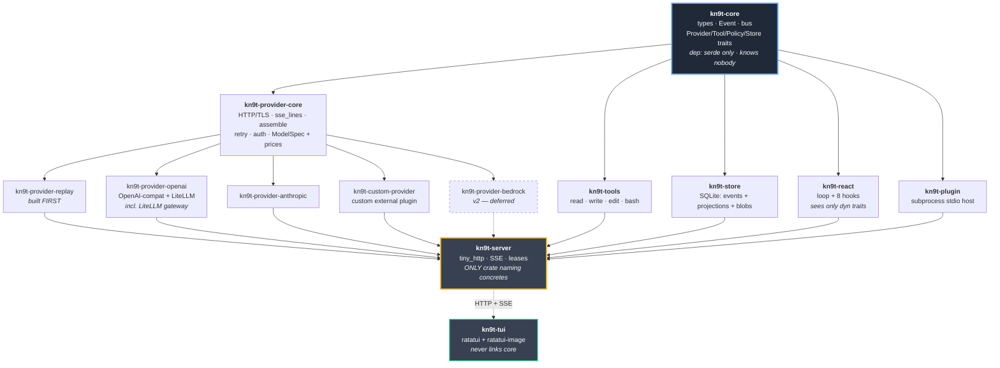

**Enforced invariant:** any crate other than `kn9t-server` with more than one
workspace dependency means the design has leaked. `kn9t-react` in particular must
never name a concrete `Provider`, `Tool`, or `Store`.

`kn9t-tui` is not a dependent of `kn9t-core`. It talks HTTP only. Deliberate: if the
TUI cannot reach into core, it cannot grow into a second wiring path. Pi's
`interactive-mode.ts` (222KB) versus `rpc-mode.ts` (23KB) is the failure mode being
avoided.

### 2.1 Why a separate `kn9t-provider-core`

Pi's provider layer is ~380KB of its ~600KB core: `openai-completions.ts` 59KB,
`bedrock-converse-stream.ts` 47KB, `anthropic-messages.ts` 44KB. Each independently
reimplements the same five things — wire JSON mapping, SSE parsing, delta
accumulation, partial-JSON tool-arg buffering, retry — twelve times over.

`kn9t-provider-core` owns four of the five. A provider implements only wire mapping.

**Measured, 2026-08-28** (the original ~250-line estimate was optimistic by ~3x and is
corrected here rather than left as an aspiration):

| provider | lines | notes |
|---|---|---|
| `kn9t-provider-openai` | 725 | in-process; encode + decode + cache |
| `kn9t-anthropic` (bundled plugin) | 547 | subprocess; own HTTP via `ureq` |
| `kn9t-custom-provider` (external plugin) | 1059 | subprocess, `plugins/kn9t-custom-provider`; six documented protocol hazards (spec 09) |

Two structural reasons the floor is ~550 rather than ~250:

1. **Wire mapping is genuinely two directions.** Encode (messages → provider JSON, cache
   breakpoint placement, thinking/effort quirks) and decode (SSE deltas → `Chunk`, tool-call
   correlation, usage partition per §8.4.3) are each ~200 lines before any provider
   eccentricity.
2. **Plugin providers cannot link `kn9t-provider-core`.** Per GI-1 a plugin's single
   workspace dep is `kn9t-plugin-sdk`, so `kn9t-anthropic` and `kn9t-custom-provider` bring their own
   HTTP client rather than reusing `provider-core`'s. The shared-layer saving applies fully
   only to in-process providers. Shared plugin-side concerns belong in `kn9t-plugin-sdk`
   instead — the `SseReader` there is the precedent.

The §2.1 claim that still holds: no provider reimplements delta accumulation, retry, or
partial-JSON tool-arg buffering. That was the duplication actually worth eliminating.

---

## 3. Bus and call topology

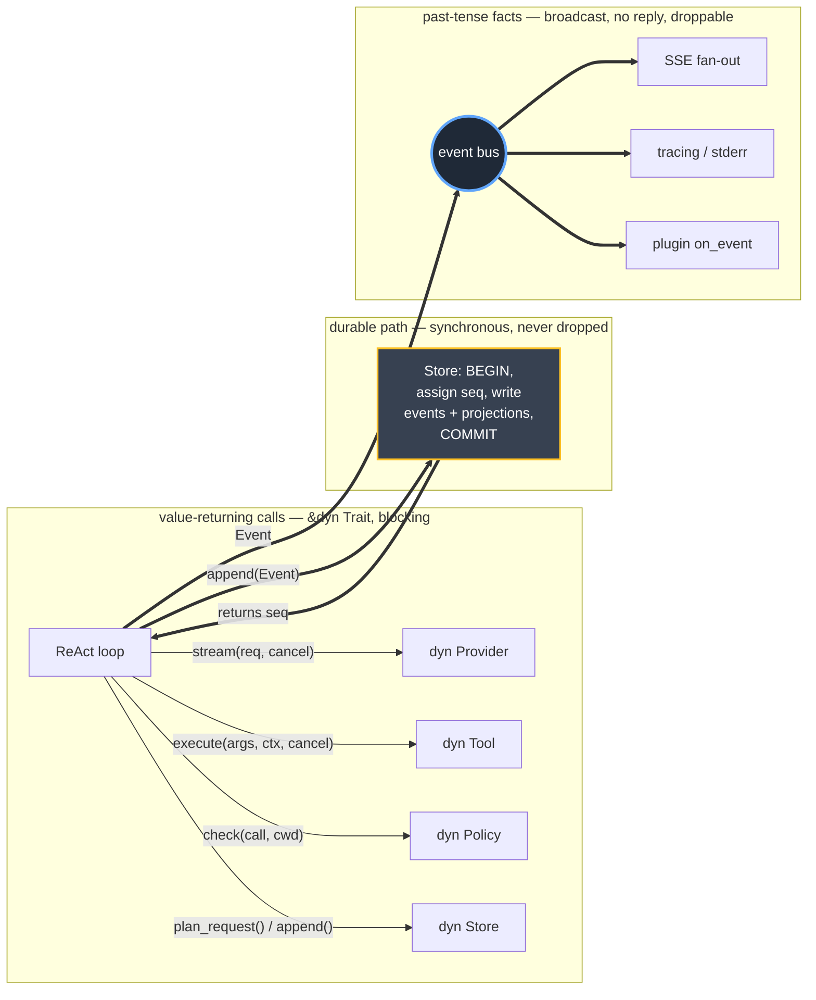

The ReAct loop is a hub — something must sequence the loop. That is acceptable
**only** because it depends exclusively on traits.

### 3.1 Durable events bypass the bus

A single bus cannot serve both tiers. Principle 3 says the publisher never blocks, but a
durable event that is dropped because a subscriber's queue was full is data loss, and
§6 makes `events` the canonical truth.

So the two tiers use two paths:

- **Durable** — the emitting thread calls `store.append(event)`, which assigns `seq`,
  writes `events` plus its projections in one transaction, commits, and returns the `seq`.
  Only then is the event published to the bus for observers. Persistence never depends on
  queue behavior.
- **Transient** — published to the bus only. Every subscriber has a bounded queue and
  **anything may be dropped when it is full**. Principle 3 holds with no exception, and
  §5.1's self-healing covers the loss.

`seq` is assigned inside that transaction, from `sessions.head_seq + 1`, which is updated
in the same transaction. One source of truth, no gaps, and correct when a subagent thread
writes to a different session concurrently. Rejected: an in-memory per-session counter —
it can diverge from `head_seq` after a failed write, and §6.2's `reproject --check` would
then be diffing against a log that already disagrees with itself.

**Accepted cost:** `append()` performs disk I/O inline, so a turn is bounded by SQLite
commit latency (sub-millisecond in WAL mode, roughly four times per turn). A durable event
is also constructed without its `seq` and receives it on write, so the durable variants are
built through a constructor rather than a struct literal.

### 3.2 Why not a pure actor model

Under full actors, executing three tool calls requires correlation IDs, a
pending-request map, and a select loop over `ToolResult | Abort | Steer` — at every
call site, in a language with no built-in `select!`. Worse, cancellation genuinely
does not work: the abort message arrives at the ReAct mailbox while the tool thread is
blocked in `read()` on a subprocess pipe and is not reading its own mailbox.

With traits the loop stays straight-line, and cancellation lives where it can actually
work — inside the tool, which checks the token and `kill()`s the child.

**Accepted cost:** module boundaries are not transparently relocatable across
processes. The one boundary that must be a process boundary (server↔client) is an
explicit wire protocol anyway.

---

## 4. Core vocabulary

Everything after this section is written against these types. They live in `kn9t-core`,
derive `Serialize + Deserialize`, and hold no handles, no `Arc`, no `&dyn` (Principle 4).

```rust
// ── identifiers ────────────────────────────────────────────────────────────
pub struct SessionId(String);   // ulid
pub struct MsgId(String);
pub struct CallId(String);      // the provider's tool-call id, verbatim
pub struct ApprovalId(u64);

// ── messages ───────────────────────────────────────────────────────────────
#[derive(PartialEq, Eq, Clone, Copy)]
pub enum Role { System, User, Assistant, Tool }

pub struct Message {
    pub id:      MsgId,
    pub role:    Role,
    pub content: Vec<Content>,
}

/// Flat: one enum covers every provider's block types.
pub enum Content {
    Text       { text: String },
    /// Never inline bytes. A `sha256:` ref into `blobs` (§12.4).
    Image      { sha256: String, mime: String },
    /// `args_json` holds the provider's exact bytes. See §4.1.
    ToolCall   { id: CallId, name: String, args_json: String },
    ToolResult { id: CallId, content: Vec<Content>, is_error: bool },
    /// `signature` is opaque and provider-owned. See §4.2.
    Thinking   { text: String, signature: Option<String> },
}

// ── models ─────────────────────────────────────────────────────────────────
pub struct ModelRef  { pub provider: String, pub id: String }

pub struct ModelSpec {
    pub r#ref:      ModelRef,
    pub api_id:     String,        // may differ from ref.id, e.g. the ":1m" pair (§8.7.5)
    pub ctx_window: u32,
    pub max_out:    u32,
    pub price:      Price,
    pub cache:      CacheMode,     // §8.4, carries min_tokens
    pub streaming:  bool,          // false ⇒ synthesize chunks (§8.7.4)
    pub quirks:     Quirks,        // provider quirks with per-model overrides (§8.3)
}

pub struct Price {                 // USD per 1M tokens
    pub input: f64, pub output: f64,
    pub cache_read: f64, pub cache_write: f64,
}

pub enum Thinking { Off, Effort(Effort), Budget(u32) }
pub enum Effort   { Low, Medium, High }

/// Wire divergences that are data, never URL-sniffed (§8.2). The full field set
/// and their failure modes are the §8.2 quirk table; providers read only the
/// fields they name. A `[[model]]` block may override any of these (§8.3).
/// `thinking_replay` is the one quirk §4.2 depends on directly.
pub struct Quirks {
    pub thinking_replay: ThinkingReplay,
    // ... remaining fields track the §8.2 table (max_tokens_field, system_role,
    //     usage_in_stream, finish_reason, reasoning, tool_result_name, ...)
}
pub enum ThinkingReplay { Verbatim, Strip }

// ── usage ──────────────────────────────────────────────────────────────────
/// Partition, not overlap: `input` counts tokens AFTER the last
/// breakpoint. Total context = input + cache_read + cache_write (§8.4.3).
pub struct Tokens {
    pub input: u32, pub output: u32,
    pub cache_read: u32, pub cache_write: u32,
    pub reasoning: u32,
}

pub struct Usage { pub tokens: Tokens, pub model: ModelRef }

pub enum StopReason { Stop, ToolUse, Length, Aborted, Refusal }

// ── tools ──────────────────────────────────────────────────────────────────
pub struct ToolSpec {
    pub name:        String,
    pub description: String,
    pub schema:      Value,        // hand-written json!({...}), §11
}

// ── errors ─────────────────────────────────────────────────────────────────
/// Provider failures. The variants are load-bearing: §8.6.6 classifies wire
/// forms into them and §8.1/§7.5 branch on them.
pub enum ProvErr {
    Connect(String),                    // pre-stream; retried inside stream() (§8.1)
    Http { status: u16, body: String }, // pre-stream; retried on 429/5xx (§8.1)
    Stream(String),                     // mid-stream error frame; fatal to the turn
    ContextOverflow,                    // prompt too long → triggers compaction (§8.6.6)
    Truncated,                          // stream ended with unfinished tool calls (§8.6.6)
    Decode(String),                     // unparseable wire bytes
}
pub struct StoreErr(pub String);
pub struct ToolErr(pub String);

// ── cancellation (§9.1) ──────────────────────────────────────────────────
/// One per turn, created by the ReAct loop at turn start. `AtomicBool` + condvar
/// behind an `Arc`. Passed to `Provider::stream` and every `Tool::execute`;
/// never a bus message (§3.2). Checked at loop boundaries and inside blocking I/O.
pub struct Cancel(/* Arc<(AtomicBool, Condvar, Mutex<()>)> */);
impl Cancel {
    pub fn cancelled(&self) -> bool;   // non-blocking poll
    pub fn cancel(&self);              // idempotent; wakes any waiter
}

// ── event sink (§8, §11) ───────────────────────────────────────────────────
/// The one seam that carries *transient* events out of `assemble()` and tools
/// without either knowing about the bus or the store. Durable events never go
/// through here — they take the synchronous `store.append()` path (§3.1).
pub trait EventSink: Send + Sync { fn emit(&self, e: Event); }

// ── hooks & forks (named by durable events) ────────────────────────────────
/// Carried by `Event::HookFailed`. One variant per hook in §13.3; `on_event`
/// is a subscription, not a hook, so it is absent.
pub enum HookName {
    BeforeToolCall, AfterToolCall, BeforeRequest, ShouldStopAfterTurn,
    PrepareNextTurn, GetSteering, GetFollowup, GetApiKey,
}
/// Carried by `SessionForked` (§7.3) and projected to `sessions.fork_reason`.
pub enum ForkReason { Fork, Rewind, Subagent, Tree }

// ── store snapshot (§7.5) ──────────────────────────────────────────────────
/// Cheap header a client or the loop reads without replaying the log.
pub struct SessionSnapshot {
    pub head_seq:   u64,
    pub ctx_tokens: u32,        // last provider-reported input + est delta (§7.4)
    pub cost_usd:   f64,        // this session's own spend, excludes inherited
    pub model:      ModelRef,
}

// ── policy input (§10) ─────────────────────────────────────────────────────
/// The dispatch-time view of a call handed to `Policy::check`. Distinct from
/// `Content::ToolCall`: args are already fully accumulated, no `Content` wrapper.
pub struct ToolCall { pub id: CallId, pub name: String, pub args_json: String }
```

### 4.1 `args_json` is stored verbatim, never re-serialized

`Chunk::ToolArgs` yields raw JSON fragments; they are concatenated and kept as a
`String`. `Tool::execute` parses to a throwaway `Value`; the stored bytes are never
regenerated from it.

This is a cache-correctness requirement, not a style preference. `serde_json` emits object
keys in `BTreeMap` order with its own whitespace, so a re-serialized assistant block almost
never matches what the provider sent — and the assistant message is part of the prefix on
every later turn. Round-tripping through `Value` would therefore miss the message-level
cache on **every turn that replays a tool call**, which is every turn of a tool loop. Same
class of bug as §8.4.2.1, self-inflicted.

A `before_tool_call` hook returning `replace{args}` does change the bytes and costs one
cache write. That is correct: the request genuinely differs.

### 4.2 `Thinking` blocks are persisted with their signature

Anthropic requires prior thinking blocks be replayed **verbatim, with signature intact**,
during tool loops; an altered signature is a 400, and a replayed block counts as input
tokens when read from cache. Stripping them silently changes the prefix and invalidates the
message cache every turn.

So thinking is durable, not transient — `ThinkingDelta` is for liveness, `Content::Thinking`
is the record. A per-provider quirk decides what reaches the wire:

| `thinking_replay` | behavior |
|---|---|
| `verbatim` | send text + signature unchanged. Anthropic, LiteLLM gateway |
| `strip` | omit the block entirely. Providers that reject unknown blocks |

**Accepted cost:** reasoning text lands in the database. That is also what makes it
auditable.

---

## 5. Events

One enum. Two tiers, distinguished by whether the variant carries `seq`.

```rust
pub enum Event {
    // ── durable: folding these in seq order reconstructs the session exactly ──
    SessionForked   { seq: u64, /* see §7.3 */ },
    MessageAppended { seq: u64, msg: Message },
    ModelChanged    { seq: u64, model: ModelRef },
    Compacted       { seq: u64, replaced: Range<u64>, summary: Message },
    UsageRecorded   { seq: u64, provider: String, model: String,
                      kind: UsageKind, tokens: Tokens,
                      price_snapshot: Price, cost_usd: f64 },

    // ── transient: liveness only. lossy is fine. never persisted. ──
    TurnStarted     { turn: u32 },
    TextDelta       { msg_id: MsgId, idx: u32, delta: String },
    ThinkingDelta   { msg_id: MsgId, idx: u32, delta: String },
    ToolArgsDelta   { msg_id: MsgId, idx: u32, delta: String },
    ToolStarted     { call_id: CallId, name: String },
    ToolProgress    { call_id: CallId, note: String },
    ToolFinished    { call_id: CallId, is_error: bool },
    ApprovalRequest { id: ApprovalId, tool: String, args: Value, cwd: PathBuf },
    TurnEnded       { turn: u32, stop: StopReason },
    HookFailed      { plugin: String, hook: HookName, reason: String },
    Error           { message: String },
}

pub enum UsageKind { Main, Compaction, Subagent, Title }

impl Event {
    /// `Some(_)` iff durable.
    pub fn seq(&self) -> Option<u64>;
}
```

### 5.1 Why two tiers

Per turn, roughly: ~2000 `TextDelta`, ~3000 `ThinkingDelta`, ~200 `ToolArgsDelta`, ~50
`ToolProgress` — versus ~4 durable events. Persisting the log verbatim writes 5000
rows to represent 4 facts. Not persisting it requires a *second* concept for "what to
write to disk".

`seq` present ⇒ durable, totally ordered, written to SQLite. Absent ⇒ drop it on the
floor if nobody is listening. One enum, so one wire type and one `match` in the client.

Transient loss is **self-healing**: a client that missed 400 `TextDelta`s still
receives the authoritative `MessageAppended` that follows.

### 5.2 Rejected: Pi's three vocabularies

Pi has `Entry` (durable), `LaneRecord` (operational: `OperationStarted`,
`StepAttempt`, `ToolStarted`, `AbortRequested`), and `TranscriptProgress` (transient) —
three concepts, each with a query API.

The operational tier buys mid-turn crash resume. **kn9t does not support mid-turn
resume**: if the process dies while streaming, the partial assistant message is lost
and the user re-prompts. Forensics (attempt 1 got a 529, attempt 2 succeeded 8s later)
go to `tracing` on stderr — different consumer, different sink, not the session log.

---

## 6. Storage

Single `~/.kn9t/kn9t.db`, WAL mode. One DB, not per-session files, because
`SELECT sum(cost_usd) ... GROUP BY model` across 400 session files is not a query. WAL
gives many readers plus one writer, so `kn9t cost` runs while an agent streams.

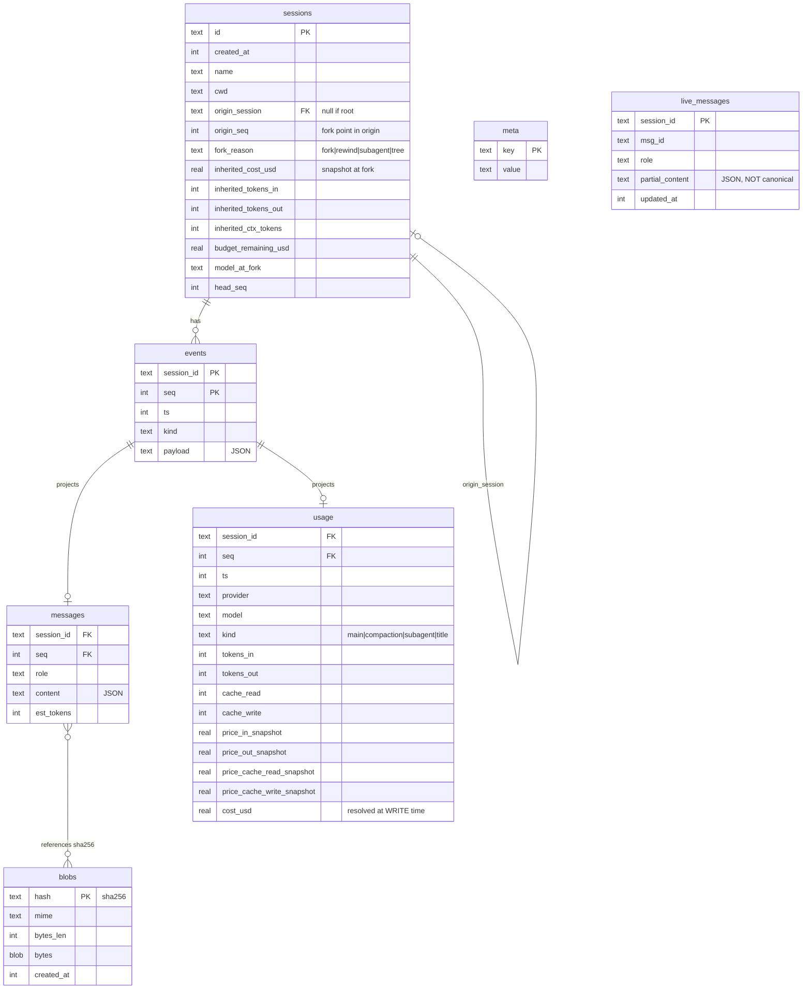

`events` is append-only and canonical. `messages` and `usage` are **projections** —
every byte recomputable from `events`. The writer inserts into both **in one
transaction**, which is also where `seq` is assigned (§3.1).

`live_messages` is outside that model entirely: a display cache for mid-stream attach
(§12.3), never replayed, truncated on startup.

### 6.1 Cost is resolved at write time

`usage.cost_usd` stores the dollar figure computed when the event was written, and
`price_*_snapshot` records the prices used. Model prices change; computing cost at
query time from a current price table means last month's numbers silently mutate.

### 6.2 `kn9t reproject`

Projection tables are derived state. `reproject` drops them, replays every event
through the same projector function the writer uses, and rebuilds.

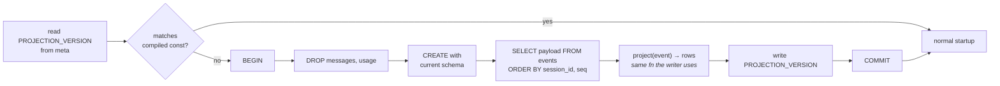

Three things this buys:

- **Schema changes stop being migrations.** Adding `usage.cache_write_cost_usd` is:
  add the column to the `CREATE`, bump `PROJECTION_VERSION`, reproject. No
  `ALTER TABLE`, no backfill script, no down-migration.
- **Bug fixes become retroactive.** Wrong cost math for a month? Fix the projector,
  reproject, history corrects itself. This works precisely because `events` stores raw
  token counts *and* the price snapshot.
- **It is a consistency check.** `kn9t reproject --check` projects into temp tables and
  diffs against live. Any difference is a writer/projector disagreement — a bug
  otherwise invisible.

Startup compares stored versus compiled `PROJECTION_VERSION` and auto-reprojects on
mismatch. Roughly 60 lines. **Ships in v1 or the projections rot.**

`events` itself never migrates. Unknown `kind` on read ⇒ skip with a warning.

---

## 7. Sessions

A session is a **linear** log. The tree lives at the *session* level, not the event
level.

Every divergence creates a **new session row**: `/fork`, `/tree`, `rewind`, and
subagent spawn. There are no lanes, no `parent_seq` on events, no branch-scoped
queries, no tree navigation inside a session.

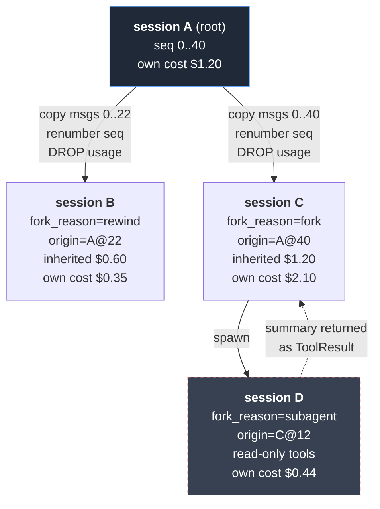

### 7.1 What this collapses

Compared with an event-level DAG plus lanes (Pi's model), the following simply do not
exist: `parent_seq`, parent-walk state reconstruction, `lane` on every event,
interleaved session-global `seq`, per-lane cancel tokens / queues / models,
`navigateTree`, `findEntriesOnBranch(query & BranchBounds)`, `getLeafId`, branch
labels, and branch summarization.

State reconstruction stays `fold(events WHERE session_id=? ORDER BY seq)`.

Concurrency stays real — a parent thread blocks while a subagent thread runs its own
session — but there is **no shared mutable state** between them. Two threads, two
`session_id`s, WAL handles the writes.

### 7.2 Fork copies context, never the bill

| event kind | copied on fork? |
|---|---|
| `MessageAppended` | yes, `seq` renumbered contiguously |
| `ModelChanged` | yes |
| `Compacted` | yes, `replaced` range remapped to the new seqs |
| `UsageRecorded` | **no** |

Copying `UsageRecorded` would double-count. Forking a long session five times to try
five approaches would inflate reported spend ~5x and make cost analytics fiction. Cost
belongs to the session that actually paid the provider.

### 7.3 `SessionForked` — seq 0 of every derived session

```rust
SessionForked {
    seq: 0,
    origin_session: SessionId,
    origin_seq:     u64,
    reason:         ForkReason,      // Fork | Rewind | Subagent | Tree
    // snapshot captured AT COPY TIME, never recomputed:
    inherited_cost_usd:   f64,       // origin's total spend up to origin_seq
    inherited_tokens_in:  u64,
    inherited_tokens_out: u64,
    inherited_cache_read: u64,
    inherited_messages:   u32,
    inherited_ctx_tokens: u32,       // provider-reported prompt size at fork point
    budget_remaining_usd: Option<f64>,
    model_at_fork:        ModelRef,
    thinking_at_fork:     Thinking,
    cwd_at_fork:          PathBuf,
}
```

Projected onto the `sessions` row so analytics needs no JSON extraction. Yields three
unambiguous numbers:

| query | meaning |
|---|---|
| `sum(cost_usd) WHERE session_id=X` | true **marginal** cost of trying this approach |
| `+ inherited_cost_usd` | effective cost to reach this state |
| recursive rollup over `origin_session` | total spend on the whole experiment family |

`budget_remaining_usd` at fork lets a child enforce a cap without querying ancestors —
which matters because subagents are the thing most likely to run away.

`inherited_ctx_tokens` means a forked session knows its context size on turn 1 without
a provider round-trip.

### 7.4 Context accounting — no tokenizer

Every provider response reports exact `input_tokens` for the request just sent. After
turn N the true prompt size is **known**. For turn N+1, estimate only the messages
added since, at `len/4`.

Rejected: linking `tiktoken` / `tokenizers`. Heavy dep, no correct table for Claude or
Gemini, and still disagrees with what the provider bills. Provider-reported-plus-delta
is both smaller and more accurate.

### 7.5 Compaction

At a configured fraction of the model's context window, summarize the oldest messages
with one extra provider call.

**Store decides; §9 executes.** Store knows token counts, so the verdict is its job. But
the summarize call is inference and produces billing, and §3 makes the ReAct loop the only
component that calls a `Provider` or emits `UsageRecorded`. A Store holding a
`&dyn Provider` would also break §2's one-workspace-dependency invariant.

```rust
pub struct RequestPlan {
    pub system:   Option<String>,
    pub messages: Vec<Message>,
    pub tools:    Vec<ToolSpec>,
    pub cache:    Vec<Cache>,               // §8.4 breakpoints
    pub compact:  Option<CompactSpan>,      // Some ⇒ summarize before sending
}

pub struct CompactSpan { pub replaced: Range<u64>, pub messages: Vec<Message> }

pub trait Store: Send + Sync {
    fn plan_request(&self, session: &SessionId) -> Result<RequestPlan, StoreErr>;
    /// Assigns seq, writes events + projections in one txn, returns the seq (§3.1).
    fn append(&self, session: &SessionId, event: Event) -> Result<u64, StoreErr>;
    fn snapshot(&self, session: &SessionId) -> Result<SessionSnapshot, StoreErr>;
}
```

Store computes the cache breakpoints too, because it is already walking the messages and
already holds `ModelSpec` for the context window. Making §9 do it would duplicate that walk.

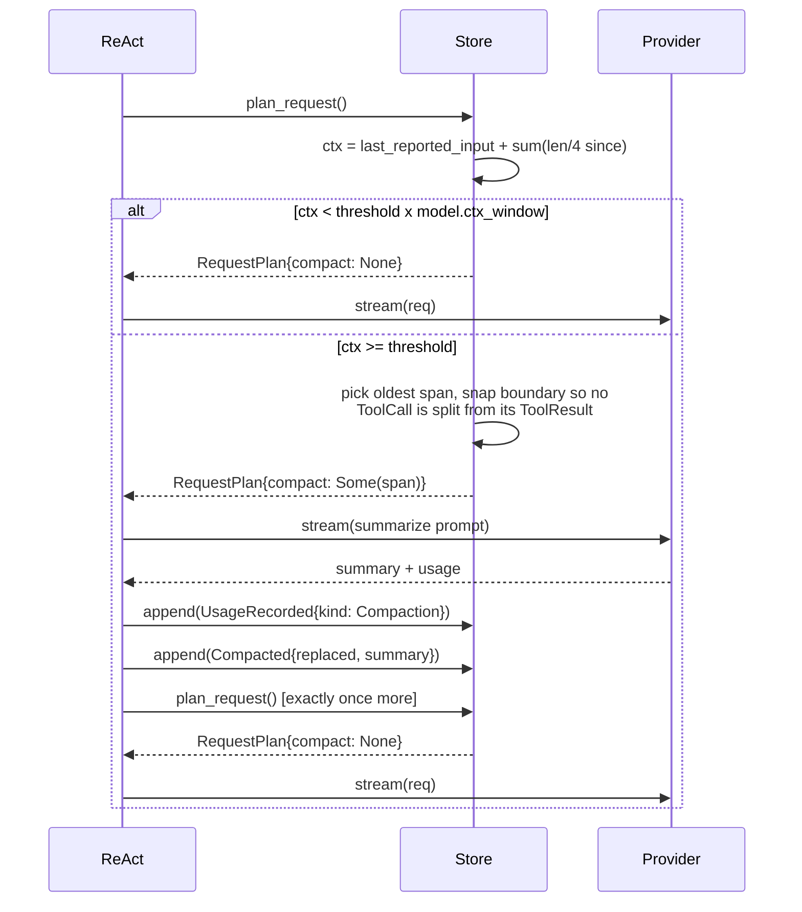

**Re-plan runs exactly once.** If the second plan still reports `compact: Some(..)`, that is
a hard error surfaced to the user — not another attempt. Each iteration is a paid provider
call, so an unbounded loop would bill without limit, which is the opposite of §6's purpose.

**Hard invariant:** never split a `ToolCall` from its `ToolResult`. Every provider
returns 400 on an orphaned tool call.

Rejected: drop-oldest. Trivial, but loses the plan agreed 20 turns ago — exactly what
breaks long coding sessions.

---

## 8. Providers

```rust
// kn9t-core — the single definition; §8.4 explains the `cache` field.
pub struct Request<'a> {
    pub model:      &'a ModelSpec,      // id, ctx window, prices, capabilities
    pub system:     Option<&'a str>,
    pub messages:   &'a [Message],
    pub tools:      &'a [ToolSpec],
    pub thinking:   Thinking,
    pub max_tokens: Option<u32>,
    /// Cache breakpoint positions in *priority* order, deduplicated and capped.
    /// NOT sorted by position (§8.4.1). Providers encode these; never choose them.
    pub cache:      &'a [Cache],
}

/// Deltas only. No running message snapshot.
pub enum Chunk {
    Text     { idx: u32, delta: String },
    Thinking { idx: u32, delta: String },
    ToolCall { idx: u32, id: CallId, name: String },
    ToolArgs { idx: u32, delta: String },   // raw JSON fragments
    Usage(Usage),
    Stop(StopReason),
}

pub trait Provider: Send + Sync {
    fn name(&self) -> &str;
    fn stream(&self, req: &Request, cancel: &Cancel)
        -> Result<Box<dyn Iterator<Item = Result<Chunk, ProvErr>> + Send>, ProvErr>;
}
```

`Iterator` works **because** of the threads decision — `next()` blocks on a socket
read. Under async this would need `Pin<Box<dyn Stream>>` plus lifetime gymnastics at
every seam.

```rust
// kn9t-provider-core — written ONCE
pub fn sse_lines(r: impl Read) -> impl Iterator<Item = Result<Vec<u8>, io::Error>>;

pub fn assemble(
    chunks: impl Iterator<Item = Result<Chunk, ProvErr>>,
    sink:   &dyn EventSink,   // emits TextDelta / ThinkingDelta / ToolArgsDelta
) -> Result<(Message, Usage, StopReason), ProvErr>;  // folds, parses tool JSON at end
```

Anthropic's `content_block_delta` / `input_json_delta` and OpenAI's
`choices[0].delta.tool_calls[]` both collapse to the same six `Chunk`s.

### 8.1 Retry lives inside `stream()`

A `RetryProvider(inner)` decorator cannot work: if it retries after 300 deltas already
reached the sink, the client has rendered garbage. Retry must happen **before the first
chunk is yielded** — connection errors and HTTP status codes only. A mid-stream failure
is a hard turn error.

### 8.2 Quirks are config data, never URL-sniffed

Each OpenAI-compatible divergence is a silent 400 or a silent capability loss:

| divergence | consequence if wrong |
|---|---|
| `max_tokens` vs `max_completion_tokens` | 400 |
| `system` vs `developer` role | 400 on o-series |
| `reasoning_effort` vs `thinking.budget_tokens` vs unsupported | 400, or silently no thinking |
| `stream_options.include_usage` supported? | **no usage, therefore no cost analytics** |
| `finish_reason` present in stream? | must infer `toolUse` from whether tool calls appeared |
| tool result requires `name`? | 400 on strict validators |
| tool-call `index` in deltas? | absent, so correlate by `id` |
| thinking as `reasoning_content` vs tag-wrapped vs dropped | thinking lost |
| LiteLLM `metadata` passthrough, `model` as routing alias | tagging lost |

Pi auto-detects these from the base URL with manual override. That silently breaks for
self-hosted LiteLLM at `http://litellm.internal:4000`, which matches no known pattern —
you fall into generic defaults and debug a 400 by reading source.

kn9t declares them explicitly:

```toml
[provider.litellm]
kind     = "openai"
base_url = "http://litellm.internal:4000"
api_key  = "env:LITELLM_KEY"

[provider.litellm.quirks]
max_tokens_field = "max_tokens"          # | "max_completion_tokens"
system_role      = "system"              # | "developer"
usage_in_stream  = true
finish_reason    = true
reasoning        = "reasoning_effort"    # | "budget_tokens" | "none"
tool_result_name = false
thinking_style   = "reasoning_content"   # | "tags" | "none"
extra_body       = { metadata = { team = "fw" } }

[[model]]
provider = "litellm"
id       = "bedrock-sonnet-4"
ctx      = 200000
max_out  = 64000
price_in         = 3.0      # USD per 1M tokens
price_out        = 15.0
price_cache_read = 0.30
```

`--dump-request` prints the exact built payload. **Accepted cost:** a wrong flag is a
runtime 400, not a compile error.

Model prices live here because `cost_usd` (§6.1) cannot be computed without them.
Rejected: a generated 400-model registry (Pi's `models.generated.ts`) — anti-minimal.
Hand-write the ~15 models actually in use.

### 8.3 Per-model quirk overrides

Some divergences are per-model, not per-provider: on one LiteLLM gateway endpoint,
`claude-sonnet-4-6` takes `reasoning_effort` while `claude-opus-5` rejects it. A
provider-level table cannot express that, so `[[model]]` carries an optional override
that is merged over the provider's:

```toml
[[model]]
provider = "my-gateway"
id       = "us.anthropic.claude-opus-5"
ctx      = 200000
max_out  = 32000
price_in  = 5.0
price_out = 25.0
price_cache_read  = 0.50
price_cache_write = 6.25

# Must be the LAST block of this model entry: a sub-table header captures every
# bare key that follows it. Same footgun as §10.1.
[model.quirks]
reasoning     = "adaptive"
require_tools = true
```

### 8.4 Prompt caching

Caching is the single largest cost lever in a coding agent: a 25K-token system prompt plus
a growing tool transcript is re-sent on every turn, and a cache read is 10x cheaper than a
fresh input token. Getting it wrong is expensive and silent in both directions — no error
either way.

The split follows §2's rule. **Where** a breakpoint goes is provider-independent, so it
belongs in core. **How** it is encoded is wire detail, so it belongs in the provider.

```rust
// kn9t-core — `Request` is defined in §8; the `cache` field carries these.

/// A position in the request the provider must mark as a cache breakpoint.
#[derive(PartialEq, Eq, Clone, Copy)]
pub enum Cache {
    /// The system prompt. Tool definitions share this prefix.
    System,
    /// Index into `Request::messages`.
    AfterMessage(usize),
}

/// Declared per provider, overridable per model (§8.3).
/// `min_tokens` is model-specific (512 Opus 5 .. 4096 Haiku 4.5), so a model
/// entry normally sets it; the provider value is only a default.
pub enum CacheMode {
    /// Caller places breakpoints explicitly. Anthropic, Bedrock, custom plugin, OpenRouter.
    Explicit { max_breakpoints: u8, min_tokens: u32 },
    /// Server-side, automatic. OpenAI. Sending cache fields is a 400 risk.
    Automatic,
    None,
}

/// Provider-independent. Mirrors applyCaching() from the opencode plugin.
pub fn breakpoints(messages: &[Message], mode: &CacheMode) -> Vec<Cache> {
    let CacheMode::Explicit { max_breakpoints, .. } = mode else { return vec![] };
    let last_user = messages.iter().rposition(|m| m.role == Role::User);
    let len = messages.len();

    // Order matters: the two stable anchors are claimed before the sliding pair,
    // so a short conversation spends its slots on the positions that pay.
    let candidates = [
        Some(Cache::System),
        last_user.map(Cache::AfterMessage),
        len.checked_sub(2).map(Cache::AfterMessage),
        len.checked_sub(1).map(Cache::AfterMessage),
    ];

    let mut out: Vec<Cache> = Vec::new();
    for c in candidates.into_iter().flatten() {
        // Same position twice would waste one of only four slots.
        if out.contains(&c) { continue; }
        out.push(c);
        if out.len() == *max_breakpoints as usize { break; }
    }
    out
}
```

Making breakpoints data on `Request` means placement is unit-testable against the replay
provider (§8.5) with no network, and a provider bug cannot silently change strategy.

#### 8.4.1 Placement: two anchors and a sliding pair

This is the algorithm already proven in the opencode NXP plugin
(`packages/opencode/src/provider/transform.ts`, `applyCaching`). It is reproduced rather
than redesigned, because it is load-bearing for cost and its behavior on real sessions is
known. Four breakpoints, two anchored and two sliding:

```
turn 2   [Sys ①] [User ②] [Asst] [Tool ③④] [Asst ...]
turn 3   [Sys ①] [User ②] [Asst] [Tool ③ ] [Asst] [Tool ④] [Asst ...]
turn 4   [Sys ①] [User ②] [Asst] [Tool   ] [Asst] [Tool ③] [Asst] [Tool ④] ...
```

- **① first system message** — the stable anchor, ~25K tokens. Written once per session and
  read on every subsequent call, because `system` sits above `messages` in the prefix
  hierarchy and nothing the conversation does can invalidate it (§8.4.2).
- **② last user message** — caches conversation history up to the current request.
- **③ / ④ second-to-last and last message** — the rolling pair. They advance every turn, so
  each turn's ④ becomes the next turn's readable prefix and a long tool loop progressively
  caches its own transcript instead of reprocessing it.

The rolling pair is the part that actually pays during agentic work. A single turn can
issue a dozen tool calls, and without ③/④ every one of them re-bills the entire transcript
at full input price.

Selection is order-sensitive and deduplicating: collect `[firstSystem, lastUser,
secondLast, last]`, drop entries already seen, then take the first `max_breakpoints`. The
dedup is not cosmetic — in a short conversation `lastUser` *is* `last`, and in a one-message
session all four collapse to two positions. Emitting the same position twice wastes a
scarce slot; Anthropic allows only four.

The resulting slice is in **priority order, not positional order**. When the conversation
ends on a user message, `lastUser` is the final index while `secondLast` is smaller, so the
positions come out descending — `[System, AfterMessage(1), AfterMessage(0)]` for a
two-message `[assistant, user]` request. Encoders must therefore treat each entry
independently and must not assume a monotonic walk; anything that iterates content blocks
in order while consuming breakpoints sequentially will attach them to the wrong blocks.
Priority order is what matters, because it is what survives the `max_breakpoints` cut.

Anthropic resolves a lookup as the **longest matching prefix** among breakpoints, which is
why keeping an older position (③) alongside the newest (④) earns its slot: if the tail
changed, ③ still hits.

Caching only pays from the **second** call onward, because the first is a write at ~1.25x.
Any turn containing a tool call already makes at least two calls, so the anchor pays off
even under `-p`. A genuinely single-call run pays the write premium for nothing; that is
the one case where `cache = false` is correct.

One divergence from the plugin, forced by §8.4's split: the plugin decides *placement* and
*encoding* in the same function, and therefore has to branch on `providerID` inside it —
message-level `providerOptions` for Anthropic and Bedrock, content-part-level for everyone
else. In kn9t placement emits `&[Cache]` positions with no provider knowledge at all, and
that message-versus-part choice moves into each provider's encoder (§8.4.4).

#### 8.4.2 The cache is a three-level hierarchy

Prefixes are built in a fixed order — **`tools` → `system` → `messages`** — and a change at
one level invalidates that level and every level below it. Nothing above it is touched.
This is the property that makes ① worth having, and it is why "the system prompt gets
re-billed" must never happen:

| what changes | tools | system | messages |
|---|---|---|---|
| tool definitions | ✘ | ✘ | ✘ |
| system prompt text | ✓ | ✘ | ✘ |
| `tool_choice` | ✓ | ✓ | ✘ |
| images added/removed | ✓ | ✓ | ✘ |
| conversation grows | ✓ | ✓ | ✘ |
| **compaction rewrites old messages** | ✓ | ✓ | ✘ |
| thinking config / effort | model-specific | model-specific | ✘ |

`system` is invalidated only by editing `system` itself or by editing `tools`. Since kn9t
loads the system prompt from a `.md` file and sends it verbatim, and tool definitions are
fixed for a session, **① is written once per session and read on every subsequent call for
as long as the TTL is refreshed.** Nothing in normal operation — not conversation growth,
not tool calls, not compaction — can invalidate it.

So the three real hazards are narrow:

1. **Editing the system `.md` mid-session.** Reloading it between turns changes the level-2
   prefix and forces one re-write. Correct behavior, worth knowing.
2. **Anything dynamic inside the system text.** A timestamp, `cwd` listing, or git branch
   interpolated into the prompt moves ① *every turn*, which is the one way to genuinely
   re-bill the system prompt forever. Dynamic context belongs in a message after the
   anchor. Reading a static file verbatim is exactly right.
3. **Unstable `tools` serialization.** Tool definitions sit at level 1, so any instability
   there invalidates all three levels — the single most expensive failure available.

#### 8.4.2.1 Why tool ordering is a real risk in Rust

Anthropic's troubleshooting guide names this explicitly: *"verify that the keys in your
`tool_use` content blocks have stable ordering as some languages (for example, Swift, Go)
randomize key order during JSON conversion, breaking caches."*

Rust belongs on that list. `std::collections::HashMap` uses a per-process random seed by
design (`RandomState`), so iteration order differs on every run. Two places matter:

- The **tool registry**. Storing `name -> ToolSpec` in a `HashMap` and serializing by
  iteration emits the tools array in a different order each process.
- **Tool arguments and JSON Schema properties.** `serde_json::Value::Object` is backed by
  `BTreeMap` (key-sorted) by default, which is stable — but with the `preserve_order`
  feature it becomes `IndexMap`, and any `HashMap<String, _>` serialized into a schema is
  unordered regardless.

This never surfaces as an error. Within one process the cache works; across restarts ①
misses, and the symptom is only a slightly worse cache hit rate. Since tools are level 1,
the miss cascades through system and messages, re-billing the entire prefix — the exact
outcome that must never occur.

**Requirements:** the tool registry is a `Vec<ToolSpec>` or `BTreeMap`, hand-written
schemas (§11) use ordered maps, and `preserve_order` stays off. Cheap to guarantee,
expensive to discover later.

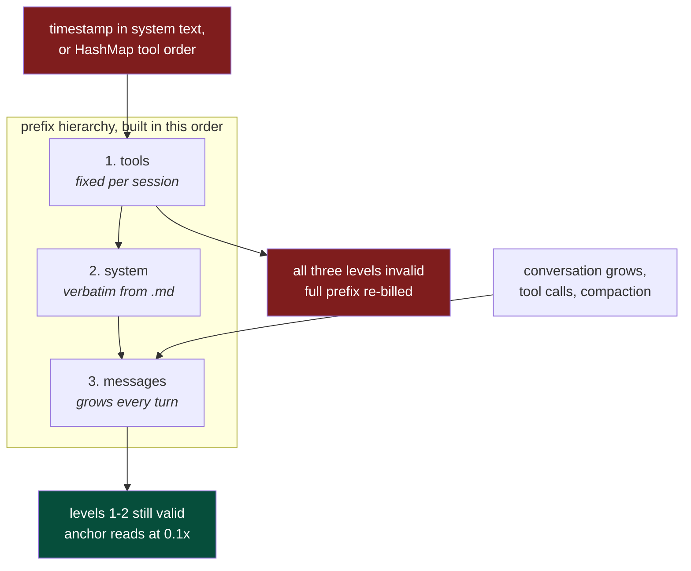

#### 8.4.2.2 Compaction costs messages only

Compaction (§7.5) rewrites the oldest messages, so it invalidates level 3 and leaves ①
intact. The turn after compaction re-writes the *message* prefix, not the system prompt.

That is a much smaller spike than a full re-write, but still a spike, and the sliding pair
③/④ is what absorbs it: those breakpoints re-establish message-level entries on the very
next turn. Two mitigations remain worth measuring (§18): snapping the compaction boundary
so ② also survives where possible, and not compacting immediately before an otherwise
cache-friendly turn. Neither is urgent now that ① is known safe.

Also silent: **`min_tokens`**. A breakpoint below the model's minimum cacheable length is
ignored with no error — and the minimum is model-specific, not a flat 1024: 512 for Opus 5,
1024 for Sonnet 4.5/4.6 and Opus 4.8, 2048 for Opus 4.7, 4096 for Opus 4.5/4.6 and
Haiku 4.5. So `min_tokens` belongs on the **model** entry, not the provider. When both
`cache_read` and `cache_write` come back 0, the prompt was not cached — that is the only
proof a marked breakpoint became a real one.

Two further constraints from the same source:

- **20-block lookback.** A breakpoint searches backward at most 20 blocks for a prior
  write. A turn that appends more than 20 blocks jumps the window and misses even though
  the content is unchanged — an independent reason the rolling pair ③/④ earns its slots.
- **TTL is measured from request start, not response end.** A 4-minute stream leaves ~1
  minute of the 5-minute window. Long generations therefore self-expire, and cache misses
  after slow turns or human deliberation are normal, not defects in cost analytics.
  Anthropic's 1-hour TTL is an opt-in at 2x write cost; deferred.

#### 8.4.3 Cost: billing is tiered, context is a sum

`input_tokens` does not mean "all input". Anthropic defines it as **only the tokens after
the last cache breakpoint**, so the three counters partition the prompt rather than overlap:

```
cache_read_input_tokens      tokens before the breakpoint, already cached
cache_creation_input_tokens  tokens before the breakpoint, being written now
input_tokens                 tokens AFTER the last breakpoint
```

Two different correct numbers come out of that:

```
# §7.4 context tracking — how full is the window
context_tokens = input + cache_read + cache_write

# §6.1 cost — each tier has its own price
cost = input       * price_in
     + cache_read  * price_cache_read     # 0.1x  price_in
     + cache_write * price_cache_write    # 1.25x price_in (2x for 1h TTL)
     + output      * price_out
```

Using `context_tokens * price_in` — the tempting move once you know `input_tokens` looks too
small — overcharges the cached prefix by 10x, in the direction that makes caching appear
worthless. The two formulas must stay visibly distinct in the projector.

This also resolves the §8.6.5 custom plugin issue: `prompt_tokens` there is the same "after the
breakpoint" quantity, so the fix is the sum above, not a reinterpretation of one field.
A caching-effective session has `input_tokens` far smaller than the real context, and that
is the expected shape, not a bug.

Note `cache_write` is a **1.25x** multiplier, not a penalty to avoid: one write at 1.25x
buys reads at 0.1x for every later turn in the TTL window. Against a ~25K-token system
prompt the write repays itself on the second call.

`usage` (§5) consequently needs both cache prices in its snapshot, alongside the existing
`price_in_snapshot` / `price_out_snapshot`. That is exactly the §6.2 case: add the columns
to the `CREATE`, bump `PROJECTION_VERSION`, reproject. No migration.

`Usage` in `kn9t-core` carries `cache_read` and `cache_write` as first-class fields.
Providers that report neither leave them zero, which costs correctly by construction.

#### 8.4.4 Per-provider encoding

| provider | mode | wire form | attach to | breakpoints |
|---|---|---|---|---|
| `anthropic` | Explicit | `"cache_control": {"type":"ephemeral"}` | message level | 4, `min_tokens` per model |
| `nxp-bedrock` (LiteLLM) | Explicit | same, passed through to Bedrock | message level | 4 |
| `kn9t-custom-provider` plugin | Explicit | `cache_control` on a custom content part | part level | 4 |
| `openrouter` | Explicit | `cache_control` ephemeral | part level | 4, varies by upstream |
| `bedrock` native | Explicit | `cachePoint` as its **own content block** | appended element | 4 (v2) |
| `openai` | Automatic | **nothing** | n/a | server-side, 1024 min |
| `gemini` | None (v2) | separate cached-content resource, TTL-billed | n/a | different model |

The "attach to" column is the whole reason encoding is per-provider. The plugin's
`applyCaching` carries the same distinction as a `providerID` branch inside the placement
function (`useMessageLevelOptions` for Anthropic and Bedrock, content-part otherwise);
here it lives in each encoder, and placement never learns about it.

Three encoding hazards, each a 400 or a silent no-op rather than a clean failure:

- Native Bedrock's `cachePoint` is a **separate element appended to the content array**,
  not an attribute on an existing block. An encoder built around "attribute on the last
  block" cannot express it at all.
- Under `CacheMode::Automatic`, cache fields must be **omitted entirely**. §8.7.4 records
  the failure this avoids: an unrecognized body field reaching a strict gateway rejects the
  whole request (`anthropicBeta: Extra inputs are not permitted`).
- Attaching to the wrong part of a custom plugin message is accepted and ignored, costing the
  breakpoint with no diagnostic.

For the custom plugin, the part that carries `cache_control` differs by message kind: the last part for
user and assistant messages, the `tool_result` part for tool results, and for the system
message the last part of the single hoisted `speaker: "system"` message (§8.6.2). The
opencode plugin needs three extractor functions
(`extractCacheControl`, `extractMessageCacheControl`, `extractSystemCacheControl`) purely
to *discover* markers arriving in four different AI SDK shapes — `cache_control` direct,
`providerOptions.anthropic.cacheControl`, `providerOptions.openaiCompatible.cache_control`,
message-level versus part-level. kn9t reads one typed `&[Cache]` off `Request`, so that
discovery layer does not exist here.

### 8.5 Provider roadmap

kn9t core knows exactly two provider kinds:

- **`kind = "replay"`** — replays fixtures from disk; no network, no keys, no spend. The
  only provider that ships inside the workspace (as `kn9t-provider-replay`). Makes the
  full test suite runnable offline.
- **`kind = "openai"`** — the one real HTTP provider. Covers everything OpenAI-compatible:
  OpenAI, LiteLLM, Groq, Together, Fireworks, OpenRouter, DeepSeek, xAI, llama.cpp,
  Ollama — they differ only by base URL and quirks (§8.2). NXP Bedrock's LiteLLM
  gateway is also `kind = "openai"` (§8.7).
- **`kind = "plugin"`** — a subprocess binary that speaks the plugin protocol (§13.7).
  The server spawns it at startup via `PluginHost::spawn()` and wraps it as a
  `RemoteProvider`. Everything else — kn9t-custom-provider (custom plugin), Anthropic, Bedrock native — is a
  plugin binary, not a core kind.

**kn9t core has zero knowledge of any specific external API.** kn9t-custom-provider is not a
core provider kind. Anthropic is not a core provider kind. They are plugin binaries that
any user can replace, skip, or swap for their own implementation. This is Q26 + Q31.

| kind | built-in crate | note |
|---|---|---|
| `replay` | `kn9t-provider-replay` | offline fixtures; testing only |
| `openai` | `kn9t-provider-openai` | any OpenAI-compatible endpoint |
| `plugin` | `kn9t-plugin` (`RemoteProvider`) | subprocess binary; any provider |

Example `~/.kn9t/config.toml`:

```toml
# OpenAI-compatible endpoint — no plugin needed, core handles it.
[provider.my-gateway]
kind     = "openai"
base_url = "https://llm-gateway.example.com/v1"
# ... (§8.7)

# custom plugin — not OpenAI-shaped, ships as an EXTERNAL plugin binary.
# Built separately (plugins/kn9t-custom-provider), so `binary` must be an absolute path.
[provider.custom-provider]
kind   = "plugin"
binary = "/abs/path/to/plugins/kn9t-custom-provider/target/release/kn9t-custom-provider"

[provider.custom-provider.env]
PROVIDER_TOKEN    = "env:PROVIDER_API_KEY"
PROVIDER_ENDPOINT = "https://provider.example.com"

[[model]]
provider = "custom-provider"
id       = "anthropic::2024-10-22::claude-sonnet-4-6-latest"
ctx      = 200000
price_in = 3.0
price_out = 15.0
price_cache_read  = 0.30
price_cache_write = 3.75

# Anthropic direct — also a plugin binary.
[provider.anthropic]
kind   = "plugin"
binary = "kn9t-anthropic"

[provider.anthropic.env]
ANTHROPIC_API_KEY = "env:ANTHROPIC_API_KEY"
```

The `binary` field is resolved as: absolute path if absolute; otherwise searched as a
sibling of the running server binary (same directory). This means `cargo build` and
`cargo install` both work without any path configuration.

### 8.6 Plugin providers — design

A `kind = "plugin"` provider is a subprocess binary the server spawns at startup.
It speaks the plugin wire protocol (§13.7) and declares `"provider"` in its hello.
The server wraps it as `RemoteProvider` (in `kn9t-plugin`) which implements the
`Provider` trait by sending `hook:"provider_complete"` and assembling streamed `chunk`
messages into the `Chunk` stream the ReAct loop expects.

**Why this is the right boundary.** The custom plugin's protocol is not OpenAI-shaped. Anthropic's
content-block protocol is not OpenAI-shaped. Putting their wire details in core would
mean core knows about every API that ever diverged. Instead:

```
kn9t-server
  └── PluginHost::spawn("/abs/.../plugins/kn9t-custom-provider/...", env)  ← external subprocess, stdio pipe
        └── RemoteProvider (kn9t-plugin)    ← implements Provider trait
              └── ReAct loop sees Provider  ← no knowledge of the custom protocol at all
```

The plugin binary owns 100% of the wire knowledge. kn9t core owns zero of it.
A user who wants a different compatible endpoint writes their own binary
or points the existing one at a different `SG_ENDPOINT`.

#### 8.6.1 Lifecycle

1. Server reads `~/.kn9t/config.toml` at startup.
2. For each `[provider.*]` with `kind = "plugin"`, it resolves the `binary` field
   (sibling of server exe, or absolute path) and calls `PluginHost::spawn(binary, env)`.
3. The handshake runs (§13 hello/hello). The plugin declares its `provider` capabilities
   and model list in its hello.
4. The server wraps the live host in `RemoteProvider` and registers it under the
   provider name. From here it is indistinguishable from an in-process provider.
5. On server shutdown, `PluginHost` sends `{"t":"shutdown"}` and reaps the child.

#### 8.6.2 Model list comes from the plugin

The plugin hello carries a `provider` declaration:

```json
{
  "t": "hello",
  "name": "kn9t-custom-provider",
  "capabilities": ["streaming", "cancelable"],
  "provider": {
    "id": "custom-provider",
    "models": [
      { "id": "anthropic::2024-10-22::claude-sonnet-4-6-latest",
        "ctx_window": 200000,
        "price": { "input": 3.0, "output": 15.0, "cache_read": 0.30, "cache_write": 3.75 } }
    ]
  }
}
```

The server merges this with any `[[model]]` overrides from config (price corrections,
aliasing). If no `[[model]]` blocks exist for a plugin provider, the plugin's declared
models are used as-is. This means **adding a new model to the plugin binary requires
no config change** — the server picks it up on next restart.

#### 8.6.3 Wire-level details belong in the plugin spec

The custom plugin has six protocol hazards (stable tool-call indices, usage undercount,
text-encoded tool calls, etc.). Anthropic has its own content-block protocol and
thinking signatures. **These details live in `spec/09-anthropic.md` and `spec/09a-custom-provider.md`**, not
here. The design boundary is clear: if it is about a specific external API, it is in the
plugin spec, not in DESIGN.md.

### 8.7 NXP Bedrock — LiteLLM gateway

Reference implementation:
`opencode/packages/opencode/src/plugin/nxp/providers/bedrock/` (`gateway.ts` 473 lines,
`plugin.ts` 348, `config.ts` 130).

The gateway is LiteLLM, OpenAI-compatible under `/v1`. So it is **`kind = "openai"`**
— §8.2's quirk table carries it, and this section is only the delta. The Converse
endpoint is deliberately not used: `/v1` exposes prompt-cache counters
(`cached_tokens`, `cache_creation_input_tokens`) in `usage`, and without those, cost
analytics and context tracking are blind.

```toml
[provider.nxp-bedrock]
kind        = "openai"
base_url    = "https://llm-gateway.rnd.nxp.com/v1"
api_key     = "env:NXP_BEDROCK_API_KEY"   # optional
auth_scheme = "omit"       # send NO Authorization header when unset

[provider.nxp-bedrock.headers]
source_identifier = "llm_vscode_vC5t068vYTsd"
# X-User-Id is injected from the resolved WBI identity, never from config.

[provider.nxp-bedrock.gateway]
check_access      = "/ldap/check_access"   # POST {} -> {"result": 0}
check_ttl_secs    = 43200                  # 12h
budget            = "/user/usage"          # POST {} -> max_budget / spend
models            = "/models"
tls_insecure      = false                  # see §8.7.5

[provider.nxp-bedrock.quirks]
max_tokens_field = "max_tokens"
usage_in_stream  = true
finish_reason    = true
reasoning        = "reasoning_effort"
thinking_style   = "reasoning_content"
```

#### 8.7.1 Identity is billing, so config must not be able to set it

Requests are attributed by the `X-User-Id` header carrying a WBI ID, and the gateway
bills that identity. Resolution order:

1. LDAP-verified identity from the launcher's keyring (`NXP_LDAP_USER`) — **always wins**.
2. `wbiID` from config.
3. `NXP_WBI_ID` / `WBI_ID` / OS username.

The precedence is the point. A project-local, repo-committed config file must never be
able to bill another engineer, so a verified identity overrides config rather than the
reverse, and a mismatch is logged. This inverts kn9t's normal "config wins" rule; the
exception is deliberate and belongs in the decision log.

#### 8.7.2 Access preflight

`POST /ldap/check_access` with `{}` returns `{"result": 0}` when provisioned. kn9t caches
success for `check_ttl_secs` and shares one in-flight check across concurrent requests.
A `401`/`403` on any later call **invalidates the cache immediately**, because the gateway
has a second authorization layer (ACC group membership) that the preflight does not cover
— without invalidation every request fails opaquely until the TTL lapses. Access is
provisioned out-of-band via ServiceNow, so the error text must name the onboarding URL;
there is no API to fix it programmatically.

#### 8.7.3 Budget feeds the cost model directly

`POST /user/usage` returns `max_budget`, `spend`, `budget_duration`,
`budget_reset_date`, and optional weekly counterparts. This is authoritative
server-side spend, and it is what `budget_remaining_usd` in `SessionForked` (§7.3) and
the §6.1 cost projection should reconcile against. Locally computed cost from
hand-written prices stays an estimate; this endpoint is ground truth.

`/v1/models` lists available models but **does not expose pricing**, which is exactly why
§8.2 requires hand-written prices.

#### 8.7.4 Three request rewrites

1. **Adaptive thinking.** `claude-opus-4-8` and the `claude-*-5` family rejected the
   legacy `thinking: { type: "enabled", budget_tokens }` shape that LiteLLM still
   generates from `reasoning_effort`. They require
   `thinking: { type: "adaptive" }` plus `output_config: { effort }`, with effort in
   `low | medium | high`. This is the per-model `reasoning = "adaptive"` override from
   §8.3, not a provider-wide setting — siblings on the same endpoint still take
   `reasoning_effort`.
2. **Adaptive thinking demands a `tools` array.** The gateway does not set
   `litellm.modify_params`, so a tool-less call — title generation, compaction — 400s.
   `require_tools = true` injects a single never-called placeholder tool with
   `tool_choice: "auto"`.
3. **Non-streaming models.** Some models reject `stream: true`. `streaming = false` on
   the model makes `kn9t-provider-core` issue a synchronous request and synthesize the
   `Chunk` sequence from the complete response, so the `Iterator` contract in §7 is
   unchanged and nothing downstream can tell.

Two rewrites the plugin needs and kn9t does **not**:

- **Terminal usage chunk.** LiteLLM attaches final `usage` to a chunk that still carries
  a choice, while `@ai-sdk/openai-compatible` only reads usage from a chunk with
  `choices: []`, so the plugin re-emits a synthetic terminal chunk. `Chunk::Usage` is
  independent of content, so there is nothing to synthesize.
- **Field-stripping workarounds.** The AI SDK parses `prompt_tokens_details` with a
  strict schema that drops `cache_creation_input_tokens`, forcing the plugin to also emit
  it at the root. kn9t's `Usage` reads whichever field is present.

Also inherited: `providerOptions` keys that a strict gateway does not recognize get
spread into the request body and 400 the whole call
(`anthropicBeta: Extra inputs are not permitted`). kn9t sends only fields named in the
quirk table — no passthrough of unknown options.

#### 8.7.5 Two hazards worth naming

**`tls_insecure` defaults to `true` in the plugin.** kn9t defaults it to **`false`**.
Disabling certificate verification by default turns a corporate MITM proxy into an
undetectable one; if a specific deployment needs it, that is an explicit opt-in with a
startup warning, not a silent default.

**The 1M-context model pair.** Some inference profiles are provisioned at 1M context.
That is a property of gateway provisioning, not of any beta flag — the
`context-1m-2025-08-07` flag is accepted by models that remain capped at 200K, so
accepting the flag proves nothing; only an oversized prompt does. kn9t registers such
models **twice**, both entries pointing at the same API id:

| config id | `ctx` | purpose |
|---|---|---|
| `us.anthropic.claude-opus-5` | 200 000 | guardrail: compacts early and cheaply |
| `us.anthropic.claude-opus-5:1m` | 1 000 000 | opts into the full window at tier pricing |

The 200K figure on a 1M-capable model is an intentional cost and auto-compaction
guardrail, not a capability limit. Do not "correct" it. Above 200K, pricing changes
(roughly 2x input), so the `:1m` entry carries its own prices and §6.1's write-time
price snapshot records which was actually used.

---

## 9. ReAct loop

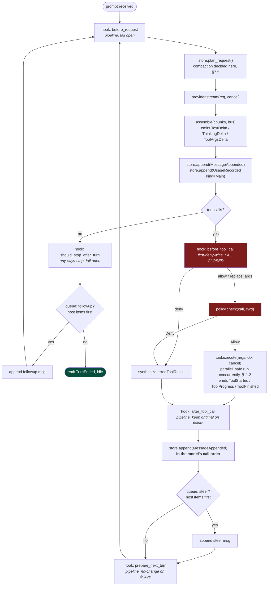

The core is ~40 lines. Everything else is hooks and queues.

### 9.1 Cancellation and what an abort costs

`Cancel` is an `AtomicBool` plus a condvar, **scoped to one turn** and created by the loop
at turn start. It is passed to `Provider::stream` and every `Tool::execute`. It is never a
bus message — §3.2 explains why that cannot work.

Abort is checked at loop boundaries only, never inside a persist step, so no transaction is
ever half-applied.

What gets recorded depends on where the abort lands:

| aborted during | recorded |
|---|---|
| provider stream | `UsageRecorded` for tokens the provider already reported; **no** `MessageAppended` |
| tool execution | the assistant `MessageAppended` (already written), every completed `ToolResult`, plus a synthesized `is_error` result for each unresolved call |

**Money spent is money recorded.** The provider billed for 4000 generated tokens whether or
not the user wanted them, so dropping the `UsageRecorded` would make §6 undercount real
spend — the exact failure it exists to prevent. If the stream was cut before any usage
arrived, the figure is an estimate and is flagged as such.

**Unresolved tool calls must be closed.** §7.5's invariant is that no `ToolCall` may lack
its `ToolResult`; every provider 400s on an orphan. An abort mid-tool-batch therefore
synthesizes `ToolResult { is_error: true, "aborted by user" }` for each call that never ran
or never finished. The transcript then matches what actually happened, including files
already modified on disk.

Rejected: rolling back the turn. The assistant message is persisted *before* tools run, so a
rollback means deleting from an append-only log (§6 forbids it) and would leave the
filesystem mutated with no record of why.

---

## 10. Permissions

```rust
pub enum Decision { Allow, Deny(String) }

pub trait Policy: Send + Sync {
    fn check(&self, call: &ToolCall, cwd: &Path) -> Decision;
}
```

The loop calls `policy.check(...)` and blocks. It has no idea whether that consulted a
TOML allowlist or blocked 90 seconds on a human.

| impl | behavior |
|---|---|
| `ConfigPolicy` | allow/deny rules from config, returns instantly. Used in `-p` and CI mode |
| `InteractivePolicy` | emits `ApprovalRequest` to the bus (a *fact*: "I am waiting"), blocks on a condvar until an `approve{id, scope}` **command** arrives |

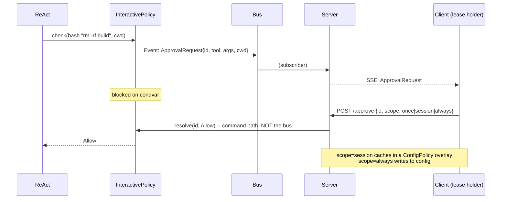

Resolution travels the **command** path, never the bus. The bus stays reply-free and
Principle 3 holds.

**Default posture: ask on mutation, auto-allow reads.** `write` and `edit` are gated
exactly as hard as `bash` — a model rewriting `~/.ssh/authorized_keys` needs no shell.

Rejected: allow-all by default. A prompt-injected model would force-push or rewrite
dotfiles with no confirmation.

### 10.1 Command allowlist for `bash`

`bash` covers both `rg pattern` and `rm -rf /`, so "auto-allow reads" needs
command-level classification. This applies **even if** dedicated `grep`/`glob`/`find`
tools are added later — `bash` remains the escape hatch and must be classified
regardless.

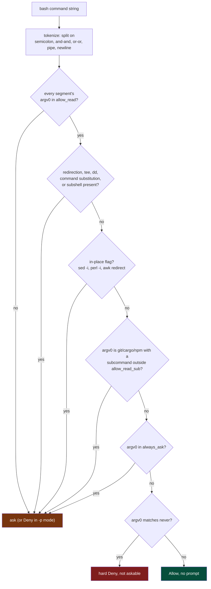

```toml
[policy]
mode = "ask_on_mutation"    # | "allow_all" | "deny_all" | "readonly"

[policy.bash]
# argv[0] values treated as read-only. Any segment outside this list means ask.
allow_read = [
  "rg", "grep", "egrep", "fgrep", "find", "fd", "ls", "cat", "head", "tail",
  "wc", "file", "stat", "which", "type", "pwd", "echo", "sort", "uniq", "cut",
  "tr", "awk", "sed", "jq", "diff", "tree", "du", "df", "env", "date",
  "basename", "dirname", "realpath", "readlink", "nl", "column", "xxd", "strings",
]

# Always ask, overriding any allow above.
always_ask = ["rm","mv","cp","chmod","chown","kill","dd","curl","wget","ssh","scp",
              "sh","bash","zsh","python","python3","node","perl","ruby","eval"]

# Never allowed, even with explicit approval.
never = ["shutdown","reboot","mkfs*","fdisk","sudo"]

# Subcommand-sensitive: allowed only with these subcommands.
# Must come last: every key above belongs to [policy.bash], and a sub-table
# header would otherwise capture them.
[policy.bash.allow_read_sub]
git   = ["log","diff","show","status","branch","blame","describe",
         "rev-parse","ls-files","remote","tag"]
cargo = ["tree","metadata","--version"]
npm   = ["ls","view","outdated"]
```

**Evaluation order:**

1. Split the command on `;`, `&&`, `||`, `|`, and newlines into segments.
2. If **any** segment's `argv[0]` is absent from `allow_read`, the whole command
   requires approval.
3. Any of `>`, `>>`, `<`, `>|`, `tee`, `dd`, command substitution (`$(...)` or
   backticks), or a subshell forces approval even when every `argv[0]` looks
   read-only — `cat x > y` is a write.
4. In-place flags force approval: `sed -i`, `perl -i`, `awk` with redirection.
   `sed` and `awk` are in `allow_read` only because rules 3 and 4 catch their
   mutating forms.
5. `always_ask` overrides any allow. Note that every interpreter (`sh`, `bash`,
   `python`, `node`, `perl`) is listed, which closes the obvious
   `sh -c 'rm -rf /'` bypass.
6. `never` entries are refused even with approval, and are not presented as an
   approval prompt at all.

**Accepted cost:** this is a heuristic classifier, not a sandbox. It is defense in
depth against an unhelpful model, not a security boundary against an adversarial one.
Real isolation is a container, which is orthogonal and recommended for unattended runs.

---

## 11. Tools

```rust
pub struct ToolOutput {
    pub content:  Vec<Content>,     // what the MODEL sees, truncated
    pub details:  Option<Value>,    // what the UI and DB see, full
    pub is_error: bool,
}

pub trait Tool: Send + Sync {
    fn spec(&self) -> &ToolSpec;    // name, description, hand-written JSON Schema
    fn execute(&self, args: &Value, ctx: &ToolCtx, cancel: &Cancel)
        -> Result<ToolOutput, ToolErr>;
    fn parallel_safe(&self) -> bool { false }
}
```

**Truncation applies only to `content`.** A search hitting 8000 matches sends the model
200 lines and writes all 8000 to `details`. The UI can expand; the context stays
bounded. Pi truncates and discards.

v1 tool set: `read`, `write`, `edit`, `bash`. Search goes through `bash` plus `rg`,
which is why §10.1 exists.

Schemas are hand-written `json!({...})` literals — zero deps. **Accepted cost:**
renaming a param field silently breaks the schema until an integration test catches it.
Rejected `schemars` (~10 crates) on dep-budget grounds; revisit if this bites.

### 11.1 `edit` staleness guard

Exact-string-replace with a uniqueness check is the proven design, but it is unsafe
without a freshness guarantee — otherwise the model replaces text in a file it is
hallucinating.

`ToolCtx` carries a per-session `HashMap<PathBuf, (Sha256, mtime)>` populated by `read`.
`edit` requires all three:

1. The path has been `read` in this session, else `Err("read the file first")`.
2. The current hash matches the recorded hash, else
   `Err("file changed on disk since you read it; re-read before editing")`.
3. `old_string` occurs **exactly once**, else `Err("N matches, need unique context")`.

On success, update the recorded hash so consecutive edits work without re-reading.

`write` to an existing path is subject to (1) and (2). `write` to a new path is not.

### 11.2 Parallel execution and the shared hash map

Tools whose `parallel_safe()` returns `true` (v1: `read` only) run concurrently within a
single batch. `write`, `edit`, and `bash` stay sequential — they mutate the filesystem, and
a wrongly-marked one would race.

That makes §11.1's path→hash map shared mutable state, so `ToolCtx` holds it behind a mutex:

```rust
pub struct ToolCtx {
    pub cwd:  PathBuf,
    pub read: Arc<Mutex<HashMap<PathBuf, (Sha256, SystemTime)>>>,
    pub bus:  Arc<dyn EventSink>,
}
```

The lock is held **only** for a lookup or an insert, never across file I/O — otherwise one
slow disk read would serialize the very tools being parallelized. Since only reads run
concurrently, the map is read-mostly and contention is negligible.

**Ordering:** results are persisted in the order the model emitted the calls, regardless of
which finished first. Deterministic transcripts are what make replay fixtures (§16)
comparable and `reproject --check` (§6.2) meaningful. A fast tool's result therefore waits
on slower earlier ones before being written.

Transient events (`ToolStarted`, `ToolProgress`, `ToolFinished`) interleave freely — they
already carry `call_id` for demultiplexing, and §5.1 permits losing them entirely. Buffering
them per call to keep the UI tidy would defeat the point of live progress.

---

## 12. Server and clients

One server process, N clients. The server is **always** a separate process — even when
a client just spawned it. One wiring path only.

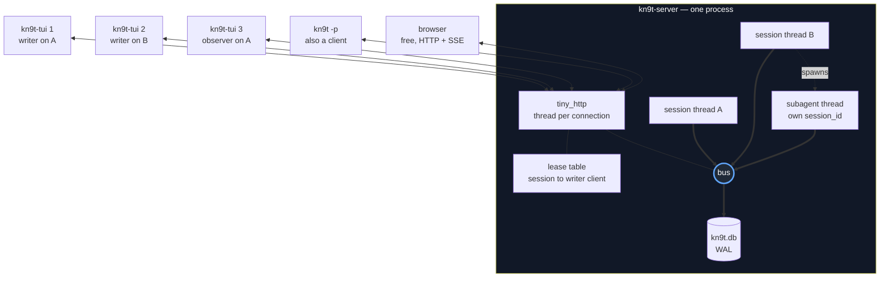

### 12.1 HTTP surface

```
POST   /session                        create; body {cwd, model?, name?}
GET    /session                        list
GET    /session/{id}                   snapshot {meta, head_seq, transcript}
POST   /session/{id}/fork              {origin_seq, reason} -> new session id
DELETE /session/{id}
GET    /session/{id}/events?from={seq} SSE; replays durable > seq, then live
POST   /session/{id}/lease             acquire write lease (?takeover=1 to steal)
DELETE /session/{id}/lease             release
POST   /session/{id}/prompt            {text, blobs:[sha256]}     [lease required]
POST   /session/{id}/steer             {text}                     [lease required]
POST   /session/{id}/abort                                        [lease required]
POST   /session/{id}/model             {provider, id}             [lease required]
POST   /approve                        {id, decision, scope}      [lease required]
POST   /blob                           body: bytes -> {hash, mime}
GET    /blob/{hash}                    bytes, ETag, immutable
GET    /models                         resolved registry + auth status
GET    /cost?since=&group_by=          analytics over the usage projection
GET    /budget                         provider-reported spend, where available (§8.7.3)
```

`tiny_http`: blocking, thread-per-connection, ~2 crates — maps exactly onto the threads
model. Rejected `axum`/`hyper`: pulls tokio and ~100 crates, reversing Principle 1 for
one POST endpoint and one SSE stream.

### 12.2 Lifecycle: any client may spawn the server

There is one wiring path (§2), so `kn9t -p` is a client exactly like the TUI. When nothing
is listening on the port in `~/.kn9t/port`:

1. Take an exclusive lock on `~/.kn9t/spawn.lock` — otherwise two clients starting together
   both spawn a server.
2. Spawn `kn9t serve` **detached**, then poll for `~/.kn9t/port` and connect.
3. A port file pointing at a closed socket is stale: delete and respawn.
4. Release the lock.

The server exits after a short grace period (default 5 s) once all SSE clients have
disconnected and no turn is running — so a `kn9t chat` one-shot leaves no daemon behind.
As long as any client holds an SSE connection the server stays up regardless of inactivity.
The grace is configurable (`[server] idle_exit_secs`); `0` disables auto-exit.

`POST /stop` (auth-required) triggers an immediate graceful shutdown — used by `kn9t stop`.

The server sends SSE keepalive pings (`: keepalive`) every 15 s so that a dead client is
detected via a write failure, even between turns when no events are being produced.

Rejected: an in-process server for `-p`. It is the second wiring path §2 exists to prevent —
Pi's `interactive-mode.ts` (222KB) versus `rpc-mode.ts` (23KB) divergence, reproduced.

### 12.3 Mid-stream attach sees partial text, without mutating the log

A client attaching while an assistant message is streaming would otherwise see nothing until
the message finalizes, because `MessageAppended` is written once at stream end (§3.1).

The fix does **not** touch `events`. A separate `live_messages` table holds the in-flight
text, keyed by session:

```
live_messages { session_id PK, msg_id, role, partial_content JSON, updated_at }
```

It is updated as deltas arrive, read once by a client on attach, and **deleted** when the
stream finalizes and `MessageAppended` is appended. It is explicitly **not** canonical:
§6.2's `reproject` ignores it, and it is truncated on startup.

This keeps `events` append-only. An `UPDATE` on `events` would break both §6's "events is
canonical" claim and §6.2's replay, and a crash mid-update would leave a row that is neither
partial nor final.

A crash still loses the partial message (§5.2 unchanged) — `live_messages` is a display
cache, not a resume mechanism.

### 12.4 SSE replay closes the attach race

`GET /session/{id}/events?from={seq}` must replay durable events and then go live without
missing or duplicating any. Order matters:

1. **Subscribe first**, buffering everything that arrives.
2. Read durable rows `> from` up to the current `head_seq`; emit them.
3. Read `live_messages` for the in-flight partial, if any.
4. Flush the buffer, **discarding anything with `seq <= head_seq`**.

Dedup is exact because durable events have unique, gapless `seq` (§3.1). Transient events
arriving during the window are forwarded as-is; §5.1 already permits losing them.

Rejected: read-then-subscribe. Any durable event committed in the gap is lost to that client,
and §5.1's self-healing explicitly does not cover durable events. Also rejected: holding the
write lock during the backlog read — a client attaching to a 400-event session would stall
the agent.

### 12.5 Auth is mandatory

A Unix socket would have had filesystem permissions. `127.0.0.1:PORT` does not — any
local process, **including a webpage via `fetch`**, can drive the agent. Several
local-agent tools have shipped exactly this bug.

- Random 32-byte token written to `~/.kn9t/token`, mode 0600, at startup.
- Every request requires `Authorization: Bearer <token>`.
- Any request carrying a cross-origin `Origin` header is rejected.
- Port written to `~/.kn9t/port`; clients read both files.

### 12.6 Leases

Many observers, one writer. All attached clients receive the same SSE stream. Exactly
one holds the write lease and may `prompt`, `steer`, `abort`, or `approve`; others get
`409 session_busy`. The lease releases on explicit `DELETE`, on disconnect, or after an
idle timeout, and can be stolen with `?takeover=1`.

### 12.7 Images are content-addressed

Screenshot-paste is a primary workflow, not an edge case. Base64 inline would mean a
2MB screenshot becoming 2.7MB re-sent to every attaching client on replay and inlined
into the `events` payload column.

Instead: `POST /blob` computes SHA-256 and stores once in `blobs`. Messages and events
carry `{"image": "sha256:ab3f...", "mime": "image/png"}`. Clients `GET /blob/{hash}`
with `ETag` and `Cache-Control: immutable`. The provider layer resolves refs to bytes
when building a request.

For TUI convenience, `POST /session/:id/prompt` also accepts an `images` array of inline
base64 data URIs. The server parses these, stores as blobs, and builds Content::Image
with sha256 refs — the same storage path as explicit `/blob` uploads.

Consequences: SSE frames stay small, so a late-attaching client replays 400 events
instantly instead of streaming 30MB; pasting the same screenshot twice costs one copy;
both TUI and browser cache by hash for free. Cost: a blob store (~40 lines) plus GC on
session delete.

### 12.8 TUI

`ratatui` plus `ratatui-image` (Kitty, iTerm2, and sixel with capability detection).

**Hard rule: the TUI consumes SSE and issues HTTP commands. It never links
`kn9t-core`.** If it cannot reach into core, it cannot become a second wiring path, and
a future web client needs zero server changes.

Two pre-committed limits, because a terminal UI is where minimal projects die:

- Use `ratatui-image`; do not hand-roll Kitty or sixel escape sequences.
- The input editor stops at multiline plus word-nav plus history. Pi's `editor.ts`
  reached 78KB by growing autocomplete, a kill-ring, an undo stack, and
  external-editor integration.

Reference for the budget being managed: Pi's TUI is ~300KB of source — `editor.ts`
78KB, `keys.ts` 44KB, `tui.ts` 40KB, `utils.ts` 36KB, `markdown.ts` 32KB, `latex.ts`
32KB, `terminal-image.ts` 20KB — **more than its entire agent, session, protocol, and
server combined.**

---

## 13. Plugins

A plugin is any executable speaking newline-delimited JSON over stdio — the same codec
as the HTTP layer. A plugin is effectively another client that is additionally allowed
to answer hooks.

### 13.1 Why subprocess, not dynamic libraries

**Rust has no stable ABI.** A cdylib built with a different rustc has undefined struct
layouts and vtables; passing a `String` or `Vec` across the boundary is UB; the plugin
links its own `std`, so you get two allocators and two panic runtimes, and a panic
crossing the boundary is instant UB. Workarounds (`abi_stable`, `stabby`) are heavy and
viral, and none give memory safety — one bad plugin segfaults the agent mid-turn.

Rejected WASM/wasmtime: genuine sandboxing and ~50 microsecond calls, but ~80 crates
and several MB, plus every host function hand-plumbed. The least minimal option by
dependency weight.

Subprocess gives crash isolation for free (plugin dies, host reads EOF, applies the
hook's failure posture, logs, continues), timeouts for free (stop reading, `kill()`),
and plugins in any language. Cost: ~1ms spawn plus IPC per call, which is why **no
per-delta hook may ever be exposed**.

### 13.2 Handshake and lifecycle

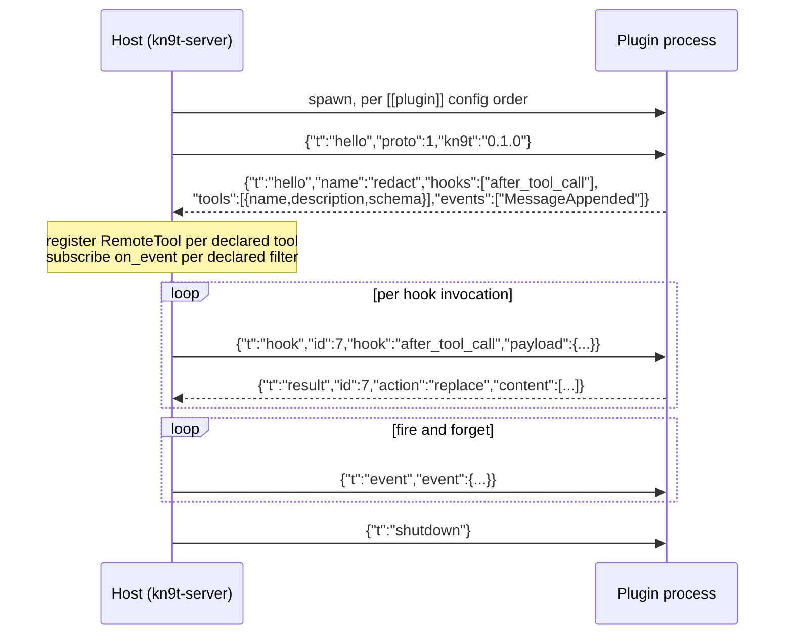

### 13.3 Hook surface

Eight hooks plus one bus subscription. Two drops from Pi's set:

- `convertToLlm` — it exists there only to support TypeScript declaration-merged custom
  message types, which kn9t does not have (Principle 4 makes `Message` both the core and
  wire type). It would be the identity function on every call while serializing the entire
  transcript across stdio.
- `transform_context` — its signature (`messages` → `replace{messages}`) is identical to
  `before_request`, and every call site that would invoke it is a call site that already
  invokes `before_request`. Two hooks that cannot be told apart is a documentation
  liability, not a feature. If a distinct compaction-time transform is ever wanted, it
  gets a payload that actually differs.

| hook | payload | reply | composition | on timeout / crash |
|---|---|---|---|---|
| `before_tool_call` | tool, args, cwd | `allow` / `deny{reason}` / `replace{args}` | first-deny-wins, short-circuits | **deny (fail closed)** |
| `after_tool_call` | tool, args, result | `keep` / `replace{content}` | pipeline | keep original |
| `before_request` | messages, model, system | `keep` / `replace{messages}` | pipeline | use original |
| `should_stop_after_turn` | stop, usage, turn | `continue` / `stop` | any-says-stop | continue |
| `prepare_next_turn` | stop, usage | `keep` / `patch{model?, thinking?}` | pipeline | no change |
| `get_steering` | — | `[]` or messages | concat, **host queue first** | empty |
| `get_followup` | — | `[]` or messages | concat, **host queue first** | empty |
| `get_api_key` | provider | `null` or key | first non-null | fall back to config/env |
| `on_event` | any `Event` | *(no reply)* | all subscribers | drop; unsubscribe after 3 consecutive failures |

`on_event` is not a hook — it is a bus subscription over IPC, and it is the entry point
for observers.

### 13.4 Composition rules

Plugins run in the order declared in config. Three composition classes:

- **Pipeline** (`before_request`, `after_tool_call`, `prepare_next_turn`): plugin B sees plugin A's output.
- **Veto** (`before_tool_call`): first `deny` wins and short-circuits the chain.
- **Collect** (`get_steering`, `get_followup`): results concatenate in declared order,
  with **host-queue items always ahead of plugin items** so client-issued steering
  cannot be starved or reordered by a plugin.

### 13.5 Failure posture

Uniform posture is wrong in both directions, so it is per-hook:

- `before_tool_call` timing out and **failing open** means an unapproved `rm -rf` just
  executed. It must fail closed.
- `before_request` timing out and **failing closed** means the agent is dead. It must
  fail open.

Every failure emits `Event::HookFailed{plugin, hook, reason}`, so a degraded plugin is
visible in the client rather than silent.

### 13.6 Timeouts

```toml
[[plugin]]
name = "redact"
cmd  = ["python3", "~/.kn9t/plugins/redact.py"]

[plugin.timeouts_ms]
before_tool_call       = 30000   # may block on a human in the plugin's own UI
after_tool_call        = 2000
before_request         = 2000
should_stop_after_turn = 1000
prepare_next_turn      = 1000
get_steering           = 500     # polled every turn; must be fast
get_followup           = 500
get_api_key            = 5000    # may perform an OAuth refresh
on_event               = 0       # fire and forget, never awaited
```

Defaults are as above. `get_steering` and `get_followup` are polled once per turn and
usually return `[]`, so their budget is deliberately tight.

### 13.7 Protocol v2 — streaming, cancellation, and provider plugins

*(Decision recorded 2026-08-26. Supersedes the v1 codec for new plugin types. Fully
specified in `spec/08b-plugin-redesign.md`.)*

The v1 protocol (one request → one result) is insufficient for three reasons:

1. **Tools need streaming.** `bash` must emit progress lines while the child runs. Over a
   pipe, the only way to do this is a new `chunk` message type sent before the final
   `done`. Without it, tools cannot move out of process.

2. **Cancellation must be interrupt-driven.** Polling `Cancel` in-process works, but a
   subprocess has no shared memory. The host must be able to send `{"t":"cancel","id":N}`
   mid-call. The plugin needs a dedicated reader thread watching for cancel messages while
   its main thread executes the call — both threads share stdin via a `Mutex<BufReader>`.

3. **Providers must be pluggable.** A provider plugin receives a full `Request` and streams
   back token deltas as `chunk` messages whose `kind` field mirrors `kn9t_core::Chunk`
   variant names. The existing in-process assembler consumes them unchanged.

**New message types:**

| direction | `t` | purpose |
|---|---|---|
| host → plugin | `cancel` | abort call N; plugin replies with error `done` |
| plugin → host | `chunk` | partial output (progress text or token delta) |
| plugin → host | `done` | final reply + accounting (replaces `result` for streaming calls) |

`result` is unchanged and remains valid for atomic (non-streaming) calls.

**Capability negotiation** happens in the hello rather than a version bump, so v1 plugins
continue to work. A plugin that does not declare `streaming` receives no `chunk`/`done`
expectations; one that does not declare `cancelable` is not sent `cancel` messages.

### 13.8 Plugin types and the SDK

A plugin may be any combination of four types, declared in its hello:

- **Tool plugin** — exposes tools to the ReAct loop via `hook:"tool_call"` messages.
- **Provider plugin** — replaces or augments an in-process provider; streams via `chunk`.
- **Hook plugin** — intercepts agent behaviour (redaction, approval, cost guards).
- **Event sink plugin** — observes bus events (logging, metrics, audit).

`kn9t-plugin-sdk` is a zero-workspace-dep crate that gives Rust plugin authors the four
traits (`PluginTool`, `PluginProvider`, `PluginHook`, `PluginEventSink`), the context
types (`ToolCallCtx`, `ProviderCallCtx`), and a `Plugin::run()` main loop that handles all
wire ceremony. Plugin authors implement traits; the SDK handles threads, codec, dispatch.

The SDK is designed for eventual crates.io publication so the ecosystem can build and share
kn9t plugins as ordinary Rust crates with a single small dependency.

### 13.9 Default tools as a subprocess plugin

The built-in tools (`bash`, `read`, `edit`) ship as a subprocess plugin binary
(`kn9t-tools`) that kn9t auto-spawns at startup. Rationale:

- Validates the full plugin code path under realistic conditions.
- Makes the tool set hot-reloadable and user-replaceable.
- `bash` streaming is the primary test of the `chunk`/`done` path.
- Subprocess overhead (~1 ms IPC) is negligible next to the tool's own execution time.

Read-tracking (the conflict-detection map `read.rs` shares with `edit.rs`) lives entirely
inside the `kn9t-tools` process — `Arc<Mutex<HashMap>>` shared between the two tool impls.
It is not carried on the wire. This is only viable because `read` and `edit` always live
in the same binary; mixing them across two separate plugins would break conflict detection.

---

## 14. Configuration and privilege

Two files, and the split between them is a security boundary, not a convenience:

| file | scope |
|---|---|
| `~/.kn9t/config.toml` | global. The **only** place privileged keys are honored |
| `<project>/.kn9t.toml` | project-local. Committed to repos, therefore untrusted |

A project-local file may set: `model`, `thinking`, the compaction threshold, system-prompt
paths, and per-project tool defaults.

It may **not** set — these are read from the global file and ignored with a warning if
present:

- `[policy]` and `[policy.bash]` — gates `rm -rf` (§10.1)
- `[[plugin]]` — executes arbitrary binaries (§13)
- any `api_key`, token path, or credential
- `tls_insecure` (§8.7.5)
- `wbiID` and any billing identity (§8.7.1, already decided)

The reasoning in §8.7.1 — a repo-committed file must never bill another engineer — applies
with more force to a key that runs a subprocess. `git clone` followed by `kn9t` must not be
arbitrary code execution.

**Accepted cost:** a genuinely per-project plugin needs an entry in the global file. That is
the point: enabling it is a decision the user makes once, outside the repo.

Rejected: a trust prompt per directory (what editors do). It needs a trust store, and in
`-p`/CI mode a trust prompt has no correct answer — it either blocks forever or auto-accepts,
and auto-accept is the vulnerability.

---

## 15. Dependency budget

Every addition needs justification against Principle 5.

| crate | for | note |
|---|---|---|
| `serde`, `serde_json` | everything | the only dep of `kn9t-core` |
| `rusqlite` (bundled) | store | bundled SQLite avoids a system-library dependency |
| `rustls`, `ureq` | provider-core | blocking HTTP client, no tokio |
| `tiny_http` | server | blocking, thread-per-connection |
| `sha2` | blobs, edit guard | content addressing |
| `toml` | config | quirks, models, policy, plugins |
| `ratatui`, `crossterm`, `ratatui-image` | tui | isolated in the one crate that never links core |
| `tracing`, `tracing-subscriber` | all | forensics to stderr, per §4.2 |

Explicitly rejected: `tokio` (Principle 1), `axum`/`hyper` (pulls tokio),
`tiktoken`/`tokenizers` (§7.4), `schemars` (§11), `abi_stable`/`wasmtime` (§13.1), a
generated model catalog (§8.2), CBOR (plain JSON is inspectable with `curl` and shares
one codec with the plugin protocol).

---

## 16. Build order

Deliberately places the replay provider before any real network call, so that every
later stage has deterministic, zero-cost tests. Pi's `faux.ts` is why their whole suite
runs without API keys; building it afterwards means never having it.

A fixture is the **raw SSE/HTTP bytes** a real provider returned, plus a small metadata
header, replayed through the genuine parser. Recorded with `--record`. This is the only form
that regression-tests the three places bugs actually live: §8.6.3's `delta_tool_calls` index
bug, custom plugin token accounting (§8.6.5), and SSE chunk-boundary buffering. Decoded-`Chunk`
fixtures would bypass every parser and make all three untestable — defeating the reason this
crate is built second.

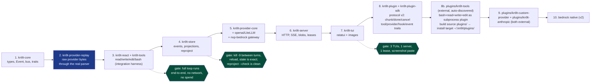

---

## 17. Decision log

| # | decision | rejected | accepted cost |
|---|---|---|---|
| Q1 | Rust, OS threads, channels, no async | tokio, C11 | thread-per-lane memory if sessions scale to hundreds |
| Q2 | bus = broadcast facts; calls = `dyn Trait` | pure actor model | module seams are not process-relocatable |
| Q3 | one `kn9t-core`; `Event` **is** the wire | separate protocol types with conversions | no event may hold non-serializable payloads |
| Q4 | single WAL SQLite; append-only `events` + typed projections; `cost_usd` at write time | JSON lines, per-session files, normalized-only | ~2x write volume; `reproject` must ship |
| Q5 | thin `Provider` yielding a delta `Iterator`; `kn9t-provider-core` owns SSE + assembly | per-provider accumulation | retry must live inside `stream()` |
| Q6 | quirks in TOML, never URL-sniffed; per-model override merged over provider | Pi's URL auto-detection | wrong flag is a runtime 400 |
| Q6b | prompt caching: placement in core as `&[Cache]`, encoding in providers; algorithm reproduced from the plugin's `applyCaching` | per-provider placement, no caching, Anthropic automatic caching | tools must be order-stable or all three prefix levels miss |
| Q6c | custom plugin: hard error below api-version 9 | legacy `/.api/llm/chat/completions` fallback | an old server is unusable rather than silently degraded |
| Q6d | text-encoded tool-call scraping **off** by default | always-on recovery (Pi/plugin behavior) | a model that cannot emit native calls needs an explicit opt-in |
| Q6e | truncation retry policy lives in the ReAct loop, not the provider | per-session counter inside `Provider` | providers stay stateless, so §8 owns one more concern |
| Q6f | NXP Bedrock verified LDAP identity overrides config `wbiID` | config-wins (kn9t's normal rule) | one deliberate inversion, because this field is billing |
| Q6g | `tls_insecure` defaults to `false` | plugin's `true` default | some deployments need an explicit opt-in |
| Q7 | 8 hooks over subprocess stdio; `Policy` trait; ask-on-mutation | `.so` (no stable ABI), WASM (80 crates), no hooks | ~1ms per hook call; no per-delta hooks |
| Q8 | declared order; pipeline / veto / collect; per-hook fail open or closed | uniform posture, exclusive claims | two composition rules to document |
| Q9 | linear session; tree at session level; every divergence is a new session row | event-level DAG with lanes | fork duplicates message rows |
| Q9b | fork copies context, never `UsageRecorded`; `SessionForked` snapshots inherited cost/tokens/ctx/budget | verbatim copy | three distinct cost figures to keep straight |
| Q10 | 4 tools; hand-written schemas; `content` / `details` split | 8 tools, `schemars`, single content field | search runs through `bash`, hence §10.1 |
| Q11 | one server / N clients; `tiny_http` + SSE; bearer token; one write lease; content-addressed blobs | unix socket + CBOR, axum, base64 inline | auth and Origin checks are mandatory |
| Q12 | ratatui + `ratatui-image`; TUI never links core | thin TUI + web client | the TUI will be the largest crate |
| Q13 | flat `Content` enum; `args_json` stored verbatim; `Thinking` persisted with signature | role-typed messages, OpenAI-shaped, parsed `Value` args | illegal combinations are representable, caught at request-build |
| Q14 | durable events bypass the bus and are written synchronously; `seq` assigned in that txn | one bus for both tiers, in-memory counter, ULID | `append()` does inline disk I/O; durable events get `seq` on write |
| Q15 | Store decides compaction, ReAct executes; re-plan exactly once | Provider injected into Store, loop until it fits | a second `CompactNeeded` is a hard error, not a retry |
| Q16 | `Cancel` per turn; abort records usage, discards message, synthesizes results for unresolved calls | roll back the turn, persist partial, no usage on abort | a turn can end with error results the model must interpret |
| Q17 | `read` runs in parallel, mutators sequential; hash map behind a mutex; results persisted in call order | all sequential, all parallel, per-thread map copies | one mutex, and a fast tool waits on slower earlier ones |
| Q18 | mid-stream partials live in a non-canonical `live_messages` table | `UPDATE` the event row, checkpoint every N deltas, no visibility | one table deliberately outside the event log |
| Q19 | SSE subscribe-then-read-then-dedup | read-then-subscribe, lock writers during backlog | a buffer during the attach window |
| Q20 | any client auto-spawns a detached server under a spawn lock | explicit `serve` only, in-process server for `-p` | needs a lock file and an idle-exit policy |
| Q21 | privileged config keys are global-only | trust prompt per directory, full merge | per-project plugins need a global opt-in |
| Q22 | replay fixtures are raw provider bytes | decoded `Chunk` NDJSON, both formats | fixtures are per-provider |
| Q23 | plugin protocol v2: `chunk`/`done`/`cancel` on same NdJSON channel; demux by `id` | second channel (socket/pipe pair), polling `cancel` flag, per-call timeout only | same channel requires `Mutex<BufReader>` shared between dispatch and cancel threads; accepted as SDK implementation detail invisible to plugin authors |
| Q24 | capability flags in hello (`"streaming"`, `"cancelable"`) instead of proto version bump | integer `proto` bump | v1 plugins continue to work alongside v2 plugins on the same host; unrecognised flags ignored |
| Q25 | tools (`bash`/`read`/`write`/`edit`) ship as an **external** subprocess plugin (`plugins/kn9t-tools`, auto-discovered in `~/.kn9t/plugins/` per ADR-0004); bootstrap installs it on first run | keep tools in-process; in-process "plugin" adapter; or bundle as `crates/internal-plugins` | subprocess validates the full plugin code path; enables hot-reload; external + auto-discovered makes the repo `plugins/` build source vs `~/.kn9t/plugins/` install target; IPC overhead (~1ms) negligible vs tool execution time |
| Q26 | providers pluggable via `hook:"provider_complete"` streaming the same `chunk`/`done` shapes; `kn9t-provider-core` becomes the reference library plugin authors may link | hard-coded in-process only; per-provider hook surface | provider plugin streams chunks whose `kind` values the existing assembler consumes unchanged — no new host assembly code |
| Q27 | read-tracking map (`read`→`edit` conflict detection) lives inside `kn9t-tools` process, not on wire | carry map in hook payload on every call; drop conflict detection | only viable because `read` and `edit` always ship in the same binary; mixing them across two plugins would break detection |
| Q28 | hot-reload: cancel in-flight calls, then shutdown old process, spawn new, re-handshake | drain (wait for completion), kill without cancel | user initiating reload accepts disruption; cancelled calls return error ToolResults the model can retry |
| Q29 | `kn9t-plugin-sdk` has zero workspace deps (only `serde`/`serde_json`) for crates.io publishability | depend on `kn9t-core` for shared types | SDK authors depend on one tiny crate; protocol schema is self-contained in §2.5–2.6 of `spec/08b` |
| Q30 | protocol spec (`spec/08b`) is language-neutral; Rust SDK is one reference implementation; Python/Node/Go SDKs are tracked follow-ups | ship SDKs in all languages before stabilising protocol | protocol must be stable before SDKs; Rust SDK proves it; other SDKs are a weekend each once protocol is proven |
| Q31 | kn9t-custom-provider + Anthropic ship as **external** standalone subprocess provider plugins (`plugins/kn9t-custom-provider`, `plugins/kn9t-anthropic`) using `kn9t-plugin-sdk`; `RemoteProvider` in `kn9t-plugin` adapts the stream into the `Provider` trait. **Refined 2026-08-28:** `kn9t-custom-provider` moved to external (outside the workspace); **Phase 3:** all plugins external — `plugins/kn9t-tools`, `kn9t-anthropic`, `kn9t-test-plugin` all standalone, auto-discovered in `~/.kn9t/plugins/` (ADR-0004); no `internal-plugins/` remains | build as `kn9t-provider-custom` / `kn9t-provider-anthropic` workspace crates depending on `kn9t-provider-core`; or keep plugins as workspace members | plugin route: no workspace dep bloat; providers become hot-reloadable; full provider-plugin code path validated in production; external enforces the SDK-only boundary structurally rather than by review (workspace membership shares a lock file and target dir and cannot prevent an in-tree dep creeping in); accepted cost: ~1ms IPC overhead per stream start, separate build step, and `binary` must be an absolute path |
| Q32 | TUI session access via `/session` command and modal overlay with fuzzy search; no left sidebar | hover-to-expand left sidebar with session list | overlay: keyboard-driven, works on welcome+chat screens, no horizontal space waste, consistent with `/models`; accepted cost: one extra keystroke to access sessions |

---

## 18. Open items

All five blocking items from the previous revision are now closed and folded into the
sections above: core vocabulary (4), Store trait and compaction ownership (7.5), bus
backpressure (3.1), cancellation and abort accounting (9.1), and config privilege (14).

What remains is deferred by choice, not unresolved by accident.

1. **Compaction prompt.** Not written. Must preserve: the current plan, file paths
   touched, decisions made, and unresolved errors.
2. **Subagent spawn tool.** Session-per-subagent is decided (7); the tool schema, its
   default tool subset, and budget-cap enforcement are not.
3. **Session titling.** `UsageKind::Title` exists in the enum; when and whether to
   generate is undecided.
4. **Blob GC.** Content-addressed blobs are shared between sessions, so deletion needs
   refcounting or a mark-and-sweep over `messages`.
5. **`--dump-request`** and `kn9t reproject --check` are named but unspecified.
6. **Windows `bash`.** 10.1 assumes POSIX shell tokenization. PowerShell segmentation
   rules differ and are unaddressed. Relevant immediately: development is on win32, so
   this is the first thing likely to bite in practice.
7. **Custom provider model catalog.** `GET /.api/llm/models` returns ids but no prices or
   context windows, so 8.6's table is hand-written. Whether to cache the list on disk
   (the plugin does, to keep startup off the network) is undecided.
8. **Budget reconciliation.** 8.7.3 makes `/user/usage` ground truth for spend while 6.1
   computes an estimate from local prices. What `GET /budget` reports, and whether drift
   between the two should warn, is unspecified.
9. **Truncation thresholds.** 8.6.6 moves retry policy into 9 but does not fix the give-up
   count or the reminder ladder. The plugin used 4 attempts and 150/100/50/25/10 lines;
   neither number is justified by anything measured.
10. **Compaction versus the rolling pair.** 8.4.2.2: compaction invalidates message level
    only, so the system anchor is safe by hierarchy, but the other three breakpoints
    re-write. Whether to snap the compaction boundary to preserve the last-user breakpoint
    needs measurement first.
11. **Cache-hit reporting.** `cache_read == 0 && cache_write == 0` is the only proof a
    breakpoint was ignored. Whether `kn9t cost` surfaces a hit rate, and warns when the
    system anchor misses (the observable symptom of the tool-ordering bug in 8.4.2.1), is
    unspecified.
12. **Cache TTL.** 5-minute default assumed throughout, measured from request start, so
    long streams self-expire. Anthropic's 1-hour opt-in at 2x write cost is unpriced.
13. **Automatic caching.** Anthropic supports a top-level `cache_control` that manages the
    breakpoint itself and consumes one of the four slots. It could replace the rolling pair
    and leave an explicit anchor for the system prompt. Not adopted: rejected by legacy
    Bedrock (400) and unavailable on the custom plugin, so it would be a fourth code path.
14. **Idle-exit timeout.** Resolved (2026-08-27): exit after 5 s grace once all clients
    disconnect (not a fixed idle timer). Keeps server alive while any client is connected.
    Cache TTL interaction: a new client reconnecting within 5 s still hits a warm cache;
    beyond that the server has already exited and the next spawn starts cold — acceptable.
